# Uncle Dave was a prepper!

Days ago a strange package from Uncle Dave arrived, it included a map and keys, but the note was cryptic and a bit confusing, but it's all starting to make sense now. It seems that Uncle Dave knew something was up and left some things for you.

Or grab the 10 years later mod and set out to find more food and fuel.

This mod provides a safehouse with water, power, and supplies. Use the options to set or exclude the various types, start with a map, or start in the safehouse.

Each safehouse is fully plumbed and powered. Keep your generator in good condition and enjoy your creature comforts like working washing machines and flushing toilets (until the tanks run dry at least).

Uncle Dave was quite a collector and you might find a complete seed library (mods that use seed in their item names should be included). He was well known for being quite a reader, so perhaps he'll have left his complete collection of skill books and magazines too (works with Glyde's Trait Magazines and probably other mods that add anything to the skill category).

Future plans:
- more locations (have some ideas, but love to hear your suggestions)

## Locations
### 1. Doe Valley
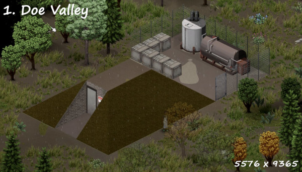 This small bunker features a large generator and water tank, a small external storage area and is stocked with plenty of supplies.
Perfect for those who prefer isolation, it's a good distance from everything.

### 2. Echo Creek Gas Station
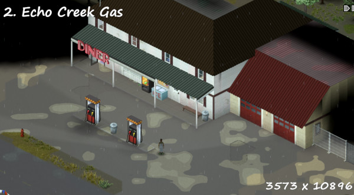 Located in the heart of Echo Creek, this service station features everything you could need. The upstairs apartments are quite comfortable and you'll find heaps of supplies stored throughout the building. The generator and water tank are in the basement and supply the whole building. Gas pumps are also wired to the generator

### 3. West Louisville Mansion
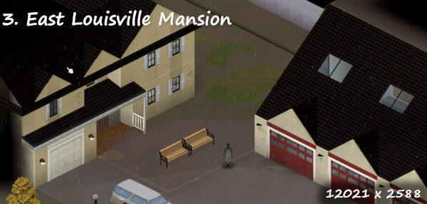 This comfortable home features a standalone three car garage. The home and garage are fully powered. Due to the proximity to the river, this home features a pumping system that allows for the water storage to be refilled from the river when the generator is powered. Enjoy some down time in the garage loft with a game of pool, or relax catching some fish. Not far from all the great things that Louisville proper has to offer.

### 4. March Ridge Bunker
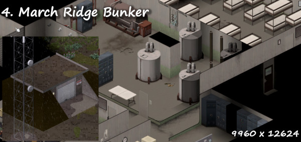 This former cold war bunker offers the ultimate in safety. With tons of well stocked storage, this fully powered facility also comes with water tanks to support your off grid needs. Enjoy doing your laundry four floors underground, or kick back and chat with folks around the world on the command center ham radio. The stairs are great exercise, but you may want to hire some help to keep the tanks filled if you plan to stay here long term. Everything is self contained to prevent fallout contamination.

### 5. Muldraugh Safehouse
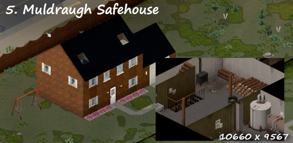 Situated at the end of a cul-de-sac, this home features an expansive two level basement with a fallout shelter on the lowest level. Generator and water tank are found in the basement, but supply utilties for the whole home. Features plenty of storage and a nice area for gardening or raising animals.

### 6. Riverside Farmhouse
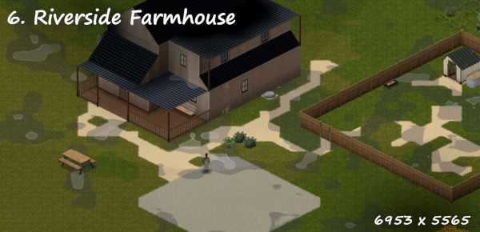 Located just east of Riverside, this farmhouse also features a two level basement, chicken coop, and fallout shelter. A little walk from the neighborhoods and shops, but far enough away for peace and quiet. Basement level generator and water tank supply the whole home.

### 7. Rosewood Gas Station
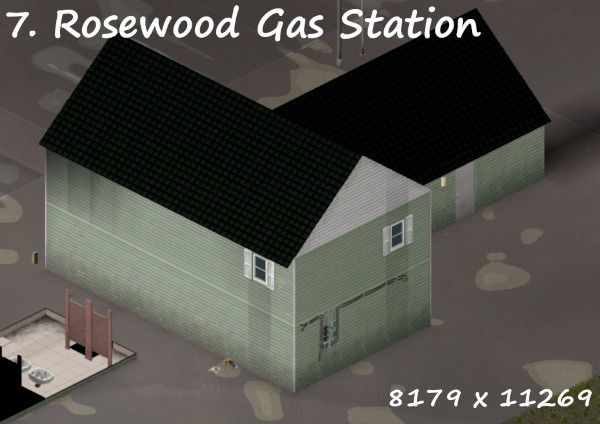 The large basement of this gas station sports a water tank and generator supplying the whole building. A comfortable upstairs aparment features all the latest amenities while the ample storage areas contain plenty of supplies. Gas pumps are also wired to the generator.

### 8. Rural West Point Mansion
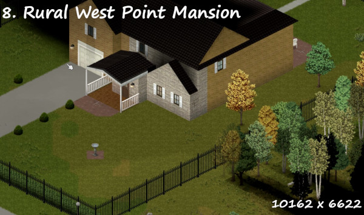 Located off the beaten path, this posh home is perfect for those seeking to get away from it all. A decent drive from West Point, this home backs up to the river. Not only is there good fishing on the river, if you make friends with the neighbor there's also a private fishing pond in the community. The two level basement includes generator, water tank, and fallout shelter. The whole home features plenty of storage and supplies.

### 9. Lowry Court Apartments
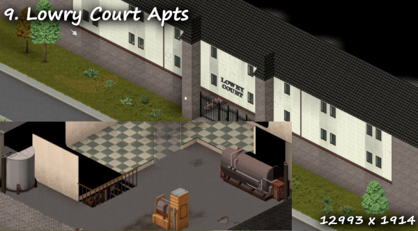 These average aparments in the center of Louisville feature massive enclosed garage areas, a private courtyard (perhaps you can organize a community garden), a fallout shelter, generator, and water storage. While the entire building is not serviced, backup power and water can be found in 3rd floor apartments on the south west side.

### 10. Grand Ohio
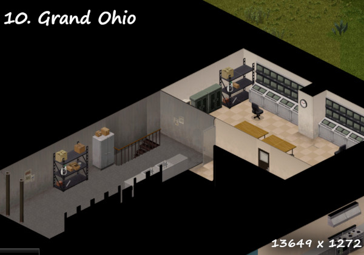 During the cold war era many public shelters were built. Now that the cold war has ended, they are often forgotten, filled with dust and relics. Found just behind the security center for the mall, this bunker features well stocked storage, power, and water, 4 floors underneath the mall proper. As with other deep facilities this was designed to protect the supplies, not make them easy to restock so you may get tired of all the stairs.

### 11. P.S. Delilah
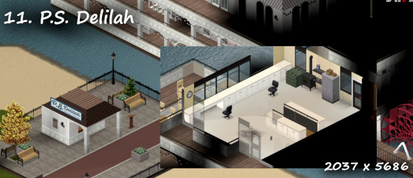 Captain your own future from the bridge of the P.S.Delilah. While the engines are no longer functioning, this riverboat still features excellent storage spaces, massive power generators, and water tanks with pumps connected to the river. Keep the generator running and you'll never have water issues. Perhaps less comfortable for sleeping arrangements, the fully stocked kitchen and bar will at least distract you for awhile.

### 12. Ekron Community College Shelter
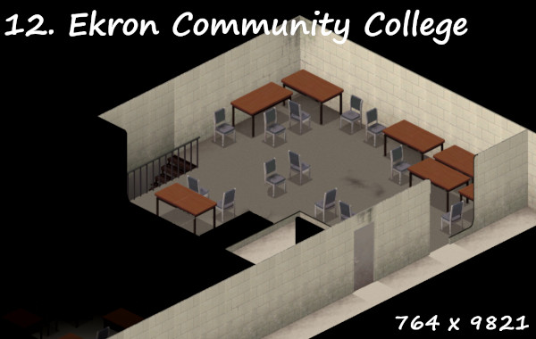 Much like the public shelter hidden in the Grand Ohio Mall, buried in the basement of the ECC, four floors down you'll find a fully featured cold war era shelter. With full water and power and plenty of supplies, you'll be right at home. Comes with easy access to the college gym, if you need more of a workout than the stairs offer.

### 13. Louisville Pawn Shop
 With comfortable upstairs apartments, this pawnshop in west Louisville features a handy rooftop generator, a two level basement with water storage and fallout shelter. While some of the tools and items within may be a little used, there's no shortage of items to choose from.

### 14. Louisville Auto Shop
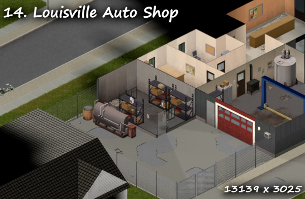 While more recently closed and up for sale, this auto shop is very centerally located in Louisville. What it lacks in creature comforts it makes up for in location. Featuring a fallout shelter in the back storage room, wood stove, generator, and water tank, it's the perfect place to visit surrounding Louisville. Be sure to check out the farming store just a couple shops down, and if you need a drink, we've left some buy one get one coupons for Ol' Scratch pool hall down the street.

### 15. Ekron Lake house
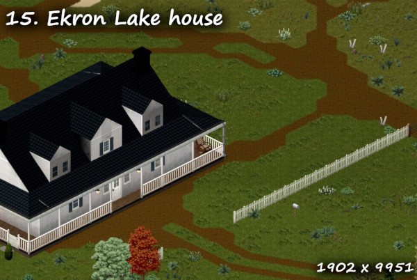 If farming year round is appealing to you, don't miss this great farmhouse. With a private lake, greenhouse, chicken coop, shed and more, it's the perfect spot for those with a green thumb. Featuring a large two level basement with fallout shelter, plenty of storage, and a handy well, you may never have to visit nearby Ekron, but should you need to, you'll find it just a few minutes drive to the west.

### 16. East Louisville Farmhouse
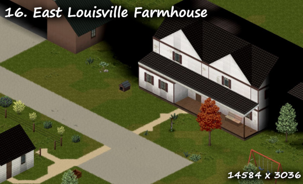 Just a few minutes east of Louisville, near the airport, this pleasent home is fully off-grid. With an expansive two level basement, fallout shelter, generator and water, your needs will be easily met here. While not offering long term water solutions, the easy access to Louisville makes supply trips a breeze. The attached pasture comes with feeding troughs, and the generator is out in the shed for a nice noise reduction in the main house.

### 17. The Caban Center Wildlife Rehab
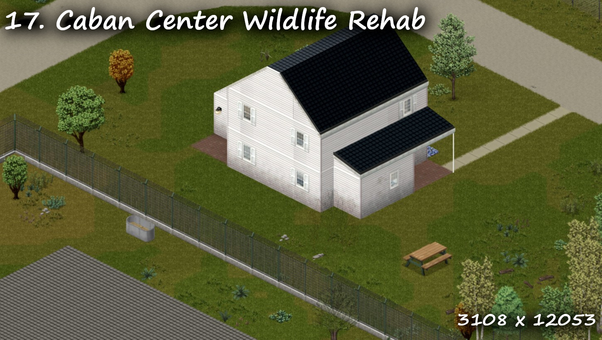 With acres of animal enclosures, you won't spend much time in the small home here. When you are kicking back, enjoy the pool table down in the two level basement, where you'll also find your water, power, and a small fallout shelter. While less convient, the basement's exterior entrance maximizes space on the first floor. The wildlife center is just a short drive from nearby Echo Creek.

### 18. McCoy Estate
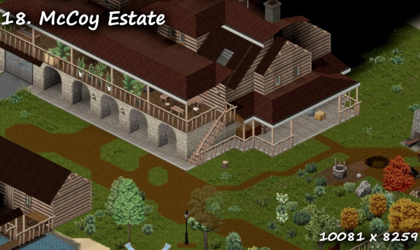 They say you can't hide money, and the McCoy estate definitly shows it. While lacking a fallout shelter, this estate is far enough away from nearby towns to be relatively safe. With extensive well stocked freezers, tools, forges and furnaces, you may find yourself getting lost going from room to room. The generator found in the shop powers a pumping system that supplies the full property with clean water from the nearby well and spring. While road access can be difficult in winter or muddy seasons, the chicken coop and well stocked gardens may keep you from ever needing to leave.

### 19. Central Louisville Mansion
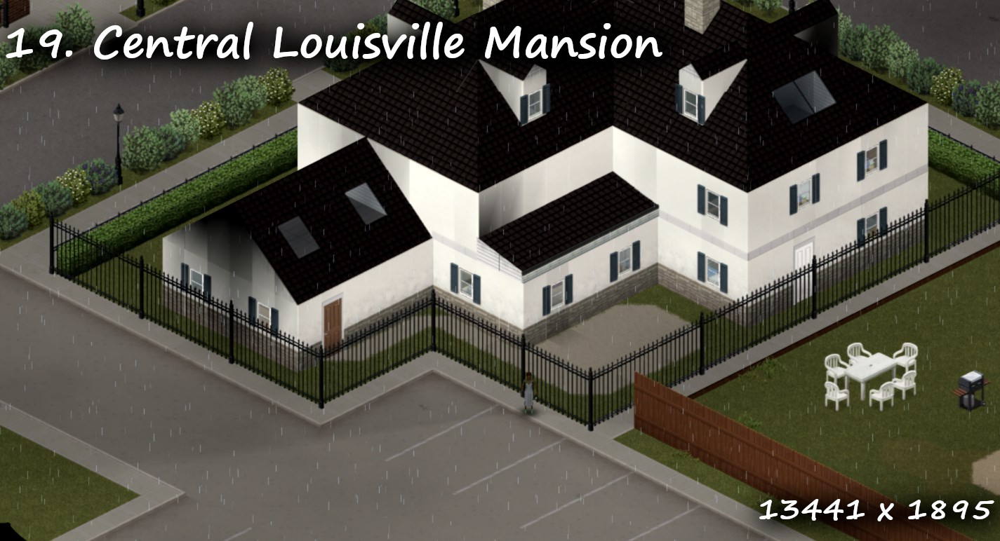 If you've ever dreamt of having a grand piano this is the spot for you. This three floor mansion features a secret basement found in the storage room and offers two more levels including a fallout shelter. Also hidden in the basement are long term water and power which supply the whole home with all it needs.

### 20. Rural Scrapyard
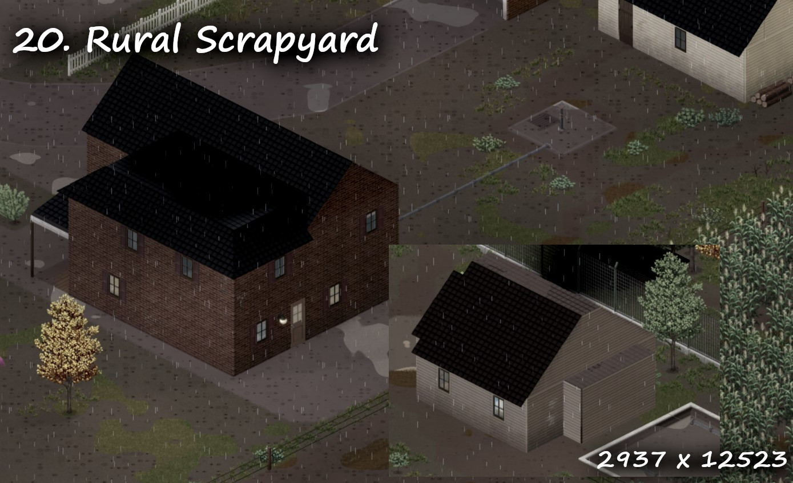 This modest two story home hides a well kept secret tunnel to the scrapyard next door. Connecting two basements, the tunnel carries water from the spring to both homes, as well as power from the generator found in the scrapyard. Well stocked, both basements offer heaps of supplies for the long term, and nearby fields promise years of harvests to come. The nearby workshop and garage are also powered by the generator.

Workshop ID: 3440887907
Mod ID: DWAP
Map Folder: DWAP