# Uncle Dave was a prepper!

Days ago a strange package from Uncle Dave arrived, it included a map and keys, but the note was cryptic and a bit confusing, but it's all starting to make sense now. It seems that Uncle Dave knew something was up and left some things for you (and hopefully there's tacos!).

Or grab the 10 years later mod and set out to find more food and fuel.

This mod provides a safehouse with water, power, and supplies. Use the options to set or exclude the various types, start with a map, or start in the safehouse.

Each safehouse is fully plumbed and powered. Keep your generator in good condition and enjoy your creature comforts like working washing machines and flushing toilets (until the tanks run dry at least). Every safehouse has a pump, if the generator is running, it will gradually refill the tank over time. Many safehouses have wells or spring water. Recent updates should allow you to move and re-plumb fixtures within a reasonable radius of the original safehouse so you can access the safehouse's water tank.

Uncle Dave was quite a collector and you might find a complete seed library (mods that use seed in their item names should be included). He was well known for being quite a reader, so perhaps he'll have left his complete collection of skill books and magazines too (works with [Gyde's Trait Magazines](https://steamcommunity.com/sharedfiles/filedetails/?id=3342191739) and probably other mods that add anything to the skill category).

## About Loot
* Each location varies a bit, but will include a "essentials" storage with some commonly needed items.
* You can turn on all the locations and all the loot but this may make your game lag the first time you get near a safehouse
* I had some trouble fitting in the skill books and if you have a bunch of mods you'll find your shelves very full 🤷‍♂️
* Recently I reworked some of the gun spawning. For most storages the lists work the same, pulling from the game's distribution lists, but I've added a "gun locker" for some spots. Instead of using the normal random distribution, it will build from a list ensuring some standard contents and a variable amount of ammo for the specific gun. At times the random spawn was giving me 10 guns and none of the clips for those guns at all. Lockers are also customized to have specific builds for the base game, but also if you use the [Vanilla Firearms Expansion](https://steamcommunity.com/sharedfiles/filedetails/?id=3434049989) or [Rain's Firearms & Gun Parts](https://steamcommunity.com/sharedfiles/filedetails/?id=3387222454) mods, you will find lockers built specifically for these mods. The guns are still random, but you'll get a full container of parts and ammo for a single gun with this change.

## Supported Mods
### Ladders?!
Many maps have been reworked to add optional support for the [Ladders!?](https://steamcommunity.com/sharedfiles/filedetails/?id=2737665235) mod. These will offer alternate exits to many maps. If the map supports it and the mod is enabled, the extra bits for where the ladders go will all be taken care of automatically. If the mod isn't enabled everything should still work normally. At the current time there is a bug for west facing ladders that have a wall to the north of them. This shouldn't impact any of the maps here and hopefully that bug will be fixed in the future.
### Functional Appliances 2
[Functional Appliances 2](https://steamcommunity.com/sharedfiles/filedetails/?id=3042138819)
Soda machines can be plumbed into safehouses that don't have them, some safehouses have popcorn machines or beer taps that the mod will make usable.
### Gun's Elevator mod
* [Gun's Elevator mod](https://steamcommunity.com/sharedfiles/filedetails/?id=3411580812)
Some safehouses have elevators, one in particular really isn't a great location without it unless you really like stairs! All the safehouses with elevators should work if you have this mod enabled and the safehouse is powered. Safehouses with elevators are all designed with access points other than the elevators if you are not using this mod.
### Rain's Firearms & Gun Parts
[Rain's Firearms & Gun Parts](https://steamcommunity.com/sharedfiles/filedetails/?id=3387222454)
Custom firearms load outs for gun lockers. Attachments, clips, and ammo for:
* Colt Commando
* HKM23
* Desert Eagle
* Sawnoff Shotgun
* AA12 Shotgun
* MP5SD
* G3
* M249
### Vanilla Firearms Expansion
Custom firearms load outs for gun lockers. Attachments, clips, and ammo for:
* SG552 Commando
* Glock 17
* Tec 9
* Walther PP
* AK74
* AA12
* Sawnoff
* MP5SD

# Warning, spoilers below 😃

## Locations
| 1. Doe Valley | 5576, 9365 |
| ------------- | ---------- |
| 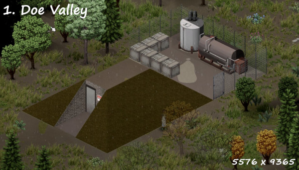 |  |
| This small bunker features a large generator and water tank, a small external storage area and is stocked with plenty of supplies. Perfect for those who prefer isolation, it's a good distance from everything. | 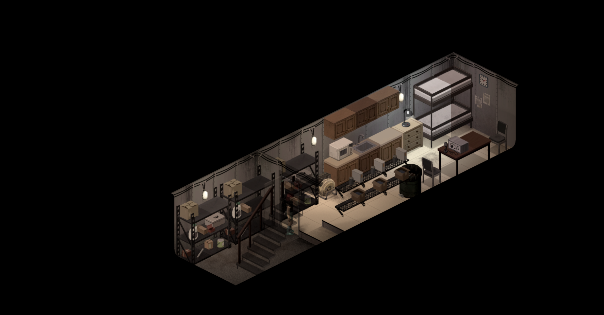 |
| ***Pros***: Isolated, plenty of trees | ***Cons***: Far from roads and major looting areas, not a lot of room for loot |

| 2. Echo Creek Gas Station | 3573, 10896 |
| ------------- | ---------- |
| 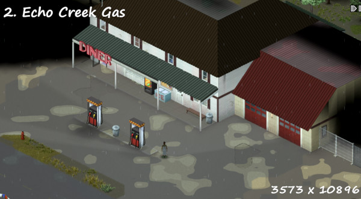 |  |
| Located in the heart of Echo Creek, this service station features everything you could need. The upstairs apartments are quite comfortable and you'll find heaps of supplies stored throughout the building. The generator and water tank are in the basement and supply the whole building. Gas pumps are also wired to the generator | 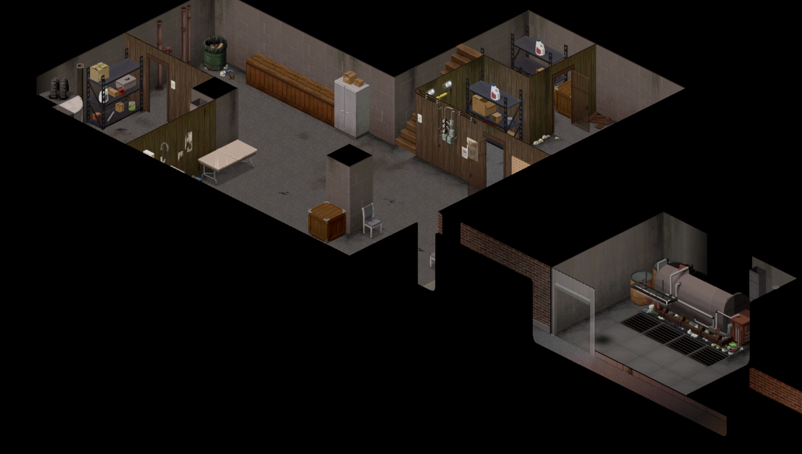 |
| Optional mods supported | * Ladders!? |
| ***Pros***: Center of small town, gas pumps | ***Cons***: far away from larger cities |

| 3. West Louisville Mansion | 12021, 2588 |
| ------------- | ---------- |
| 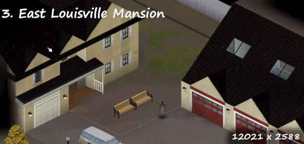 |  |
| This comfortable home features a standalone three car garage. The home and garage are fully powered. Due to the proximity to the river, this home features a pumping system that allows for the water storage to be refilled from the river when the generator is powered. Enjoy some down time in the garage loft with a game of pool, or relax catching some fish. Not far from all the great things that Louisville proper has to offer. | 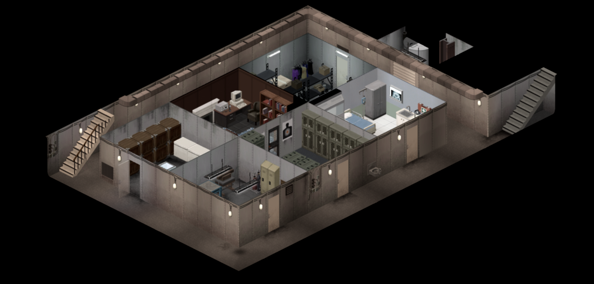 |
| Optional mods supported | * Ladders!? |
| ***Pros***: Fully custom basement map, tons of storage | ***Cons***: Tons of zombies |

| 4. March Ridge Bunker | 9960, 12624 |
| ------------- | ---------- |
| 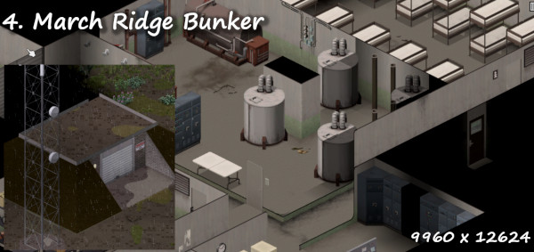 |  |
| This former cold war bunker offers the ultimate in safety. With tons of well stocked storage, this fully powered facility also comes with water tanks to support your off grid needs. Enjoy doing your laundry four floors underground, or kick back and chat with folks around the world on the command center ham radio. The stairs are great exercise, but you may want to hire some help to keep the tanks filled if you plan to stay here long term. Everything is self contained to prevent fallout contamination. | 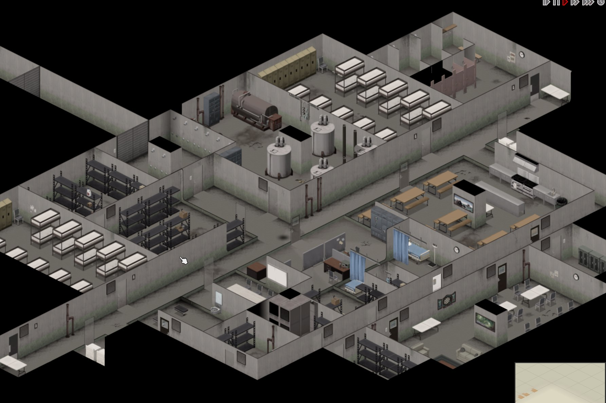 |
| Optional mods supported | * Ladders!? |
| ***Pros***: Deep basement, loads of loot | ***Cons***: Lots of stairs, lots of zombies |

| 5. Muldraugh Safehouse | 10660, 9567 |
| ------------- | ---------- |
| 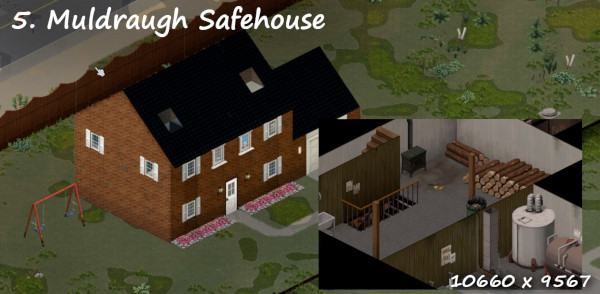 |  |
| Situated at the end of a cul-de-sac, this home features an large fallout shelter in the basement. Generator and water tank are found in the basement, but supply utilities for the whole home. Features plenty of storage and a nice area for gardening or raising animals. | 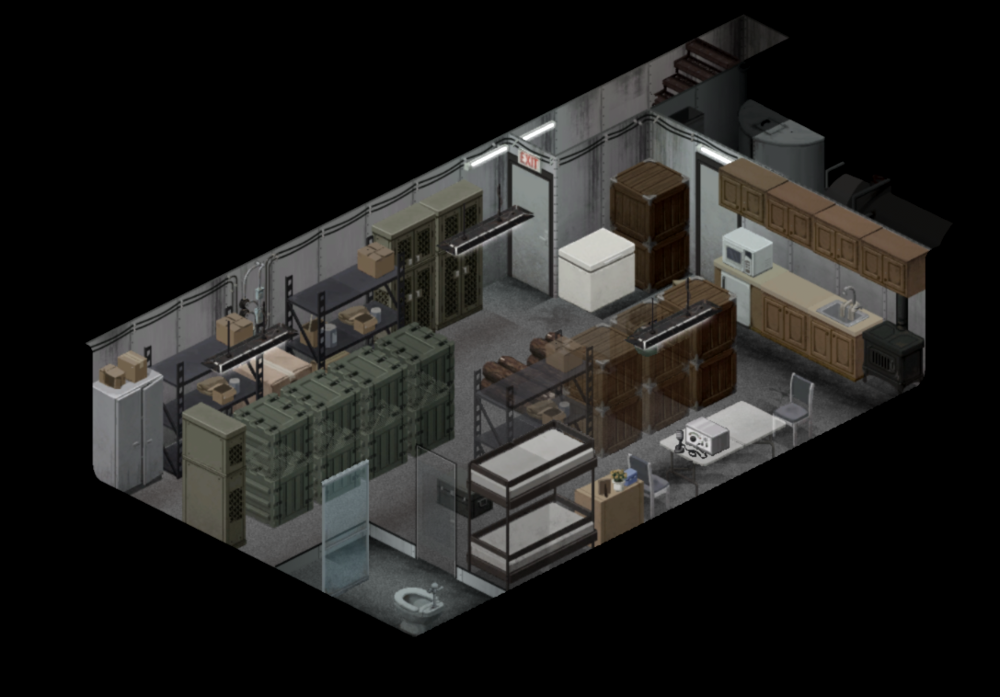 |
| ***Pros***: fully custom basement, solid location | ***Cons***: Small, lots of zombies |

| 6. Riverside Farmhouse | 6953, 5565 |
| ------------- | ---------- |
| 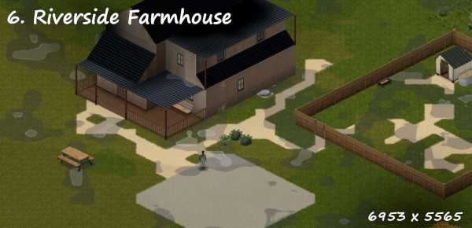 | 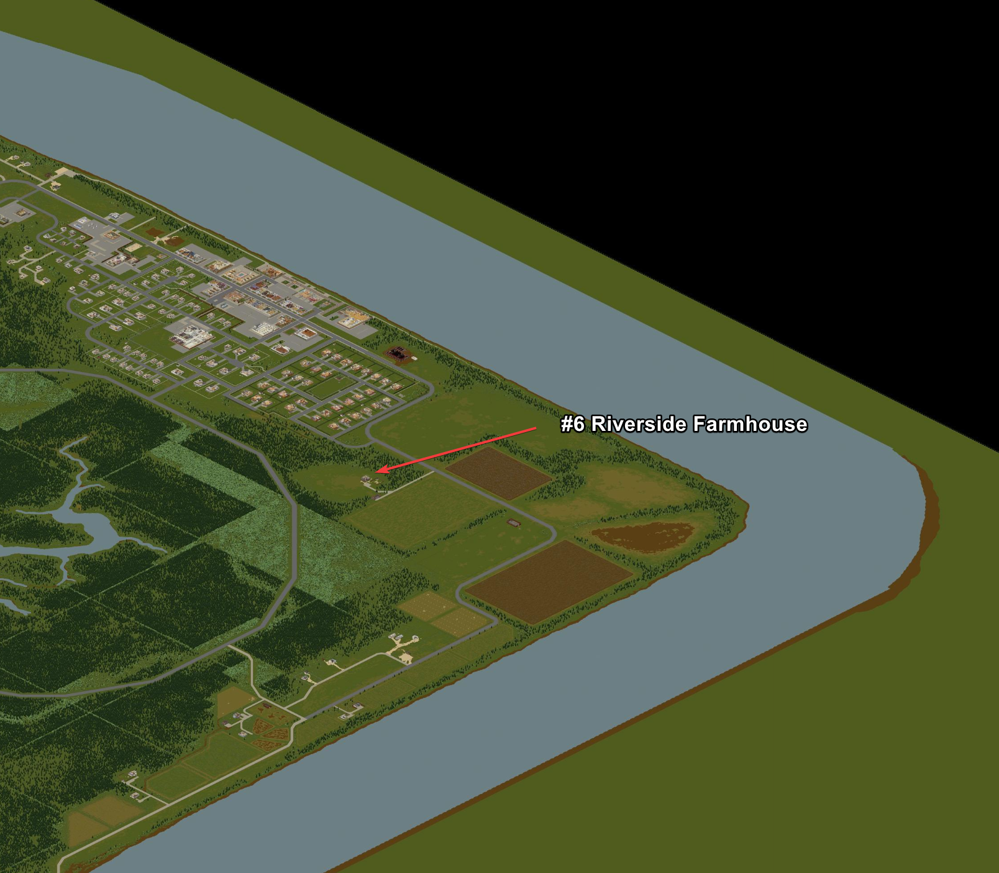 |
| Located just east of Riverside, this farmhouse also features a well equipped basement, and chicken coop. A little walk from the neighborhoods and shops, but far enough away for peace and quiet. Inviting wood paneling and fine antiques hide a sophisticated basement fallout shelter with private medical facility, security room and small bar/entertaining area. | 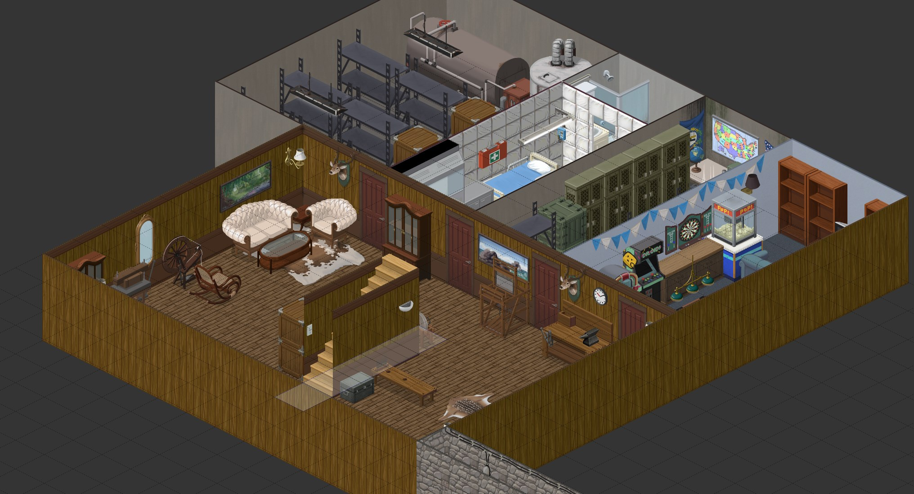 |
| Optional mods supported | * Ladders!? * Functional Appliances 2 |
| ***Pros***: reasonably isolated, 2 level basement | ***Cons***: bit of a trek to get anywhere |

| 7. Rosewood Gas Station | 8179, 11269 |
| ------------- | ---------- |
| 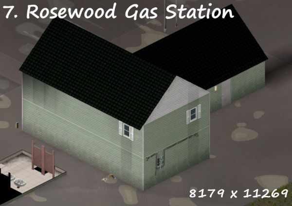 |  |
| The large basement of this gas station sports a water tank and generator supplying the whole building. A comfortable upstairs apartment features all the latest amenities while the ample storage areas contain plenty of supplies. Gas pumps are also wired to the generator. | 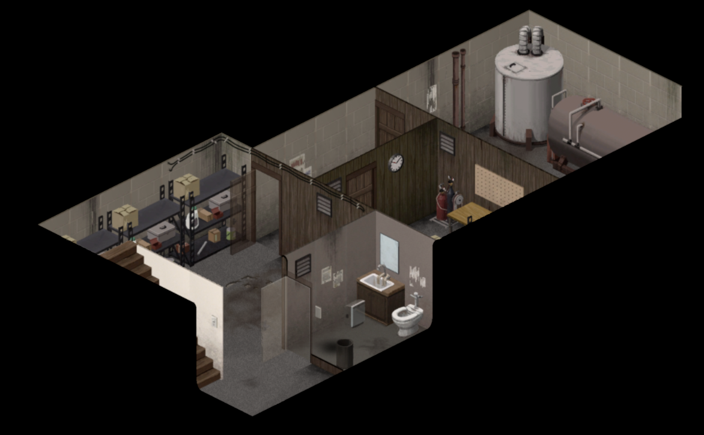 |
| Optional mods supported | * Ladders!? |
| ***Pros***: Gas pumps, edge of town location | ***Cons***: limited space, heavy zombies nearby |

| 8. Rural West Point Mansion | 10162, 6622 |
| ------------- | ---------- |
| 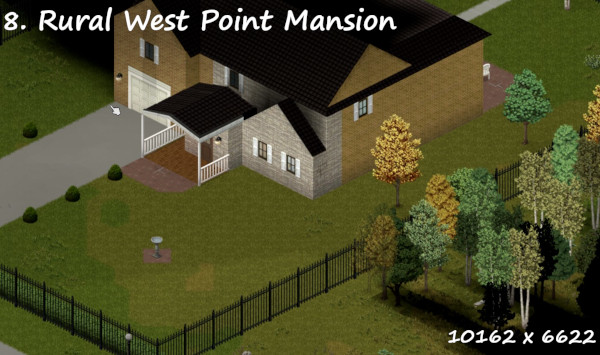 | 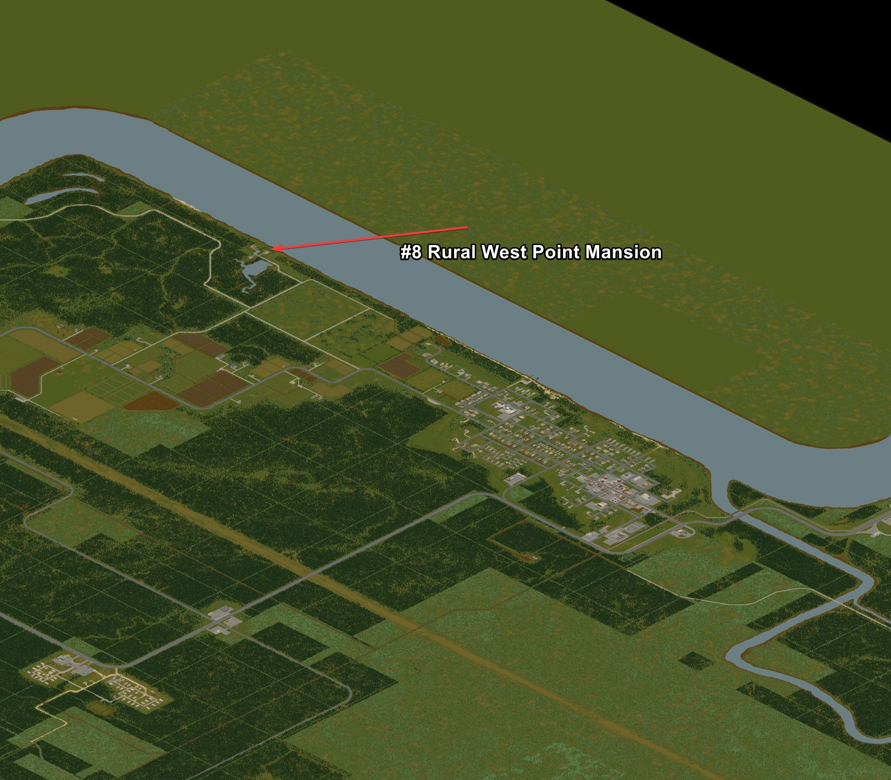 |
| Located off the beaten path, this posh home is perfect for those seeking to get away from it all. A decent drive from West Point, this home backs up to the river. Not only is there good fishing on the river, if you make friends with the neighbor there's also a private fishing pond in the community. The basement includes generator, water tank, and fallout shelter. The whole home features plenty of storage and supplies. | 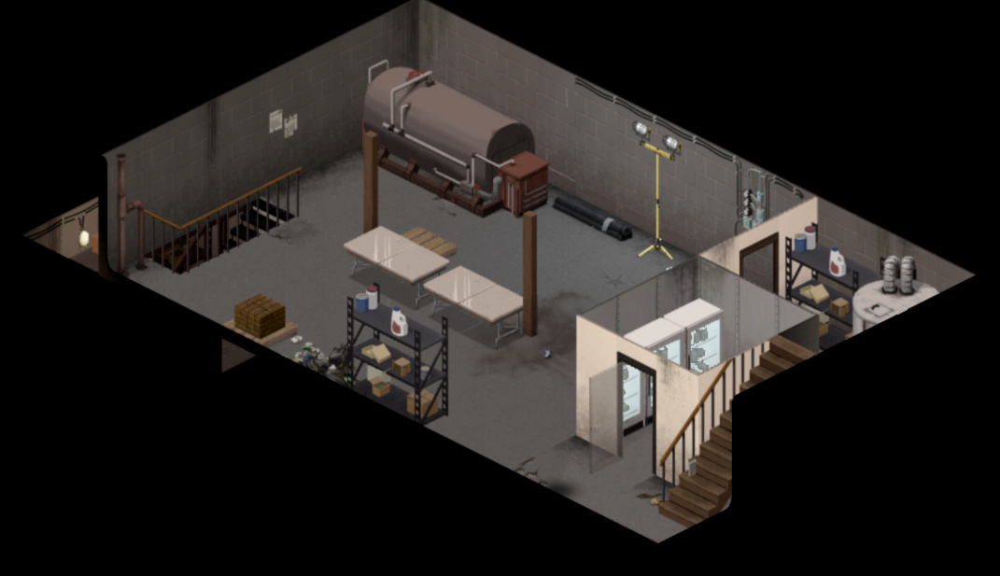 |
| Optional mods supported | * [Taylorsville](https://steamcommunity.com/sharedfiles/filedetails/?id=3134394569) * Ladders!? |
| ***Pros***: super isolated, large basement | ***Cons***: super isolated, quite a trek to town (unless playing with Taylorsville mod) |

| 9. Lowry Court Apartments | 12993, 1914 |
| ------------- | ---------- |
| 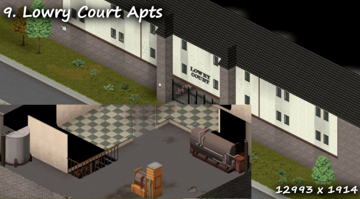 |  |
| These average apartments in the center of Louisville feature massive enclosed garage areas, a private courtyard (perhaps you can organize a community garden), a fallout shelter, generator, and water storage. While the entire building is not serviced, backup power and water can be found in 3rd floor apartments on the south west side. | 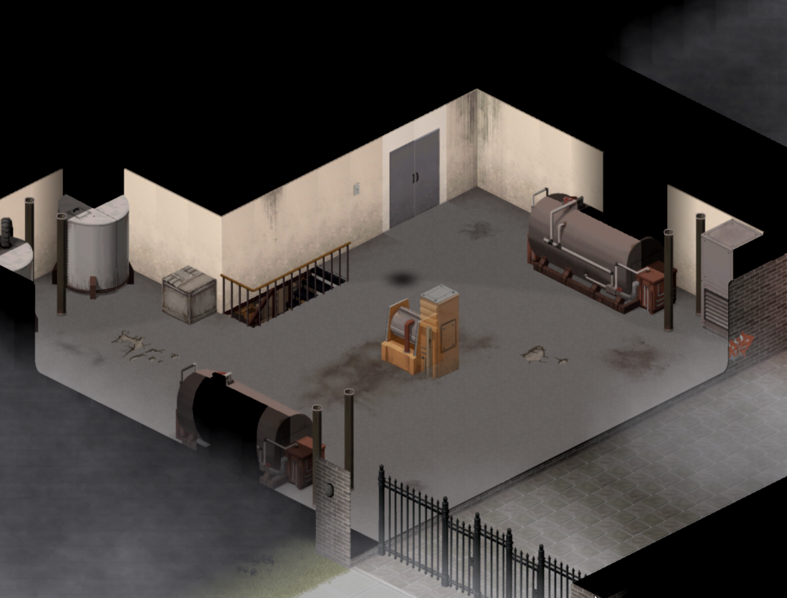 |
| Optional mods supported | * Ladders!? |
| ***Pros***: fully fenced courtyard, centrally located | ***Cons***: Huge amount of zombies nearby, limited basement area |

| 10. Grand Ohio | 13649, 1272 |
| ------------- | ---------- |
| 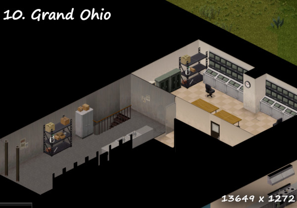 |  |
| _This is a copy of the March Ridge cold war bunker, but with the entrance just behind the mall security office_ | 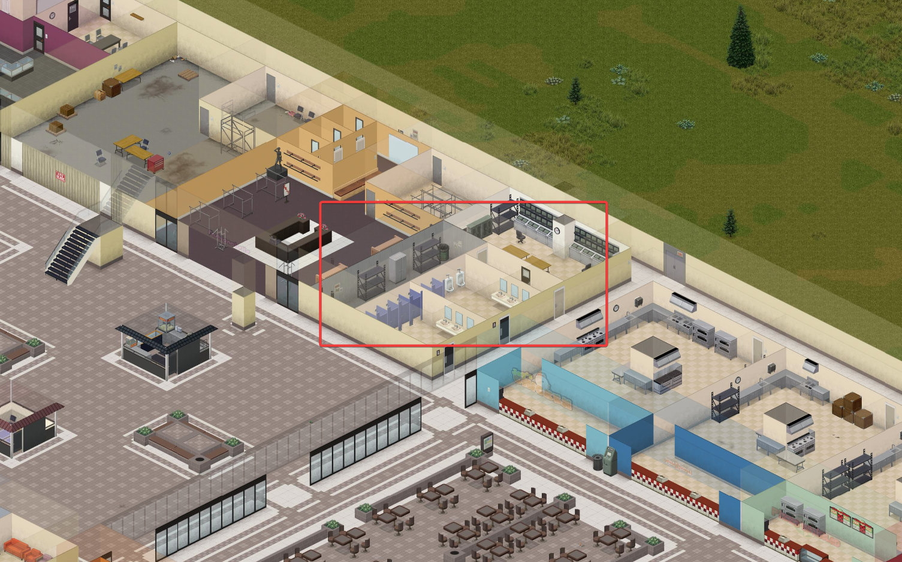 |
| During the cold war era many public shelters were built. Now that the cold war has ended, they are often forgotten, filled with dust and relics. Found just behind the security center for the mall, this bunker features well stocked storage, power, and water, 4 floors underneath the mall proper. As with other deep facilities this was designed to protect the supplies, not make them easy to restock so you may get tired of all the stairs. | 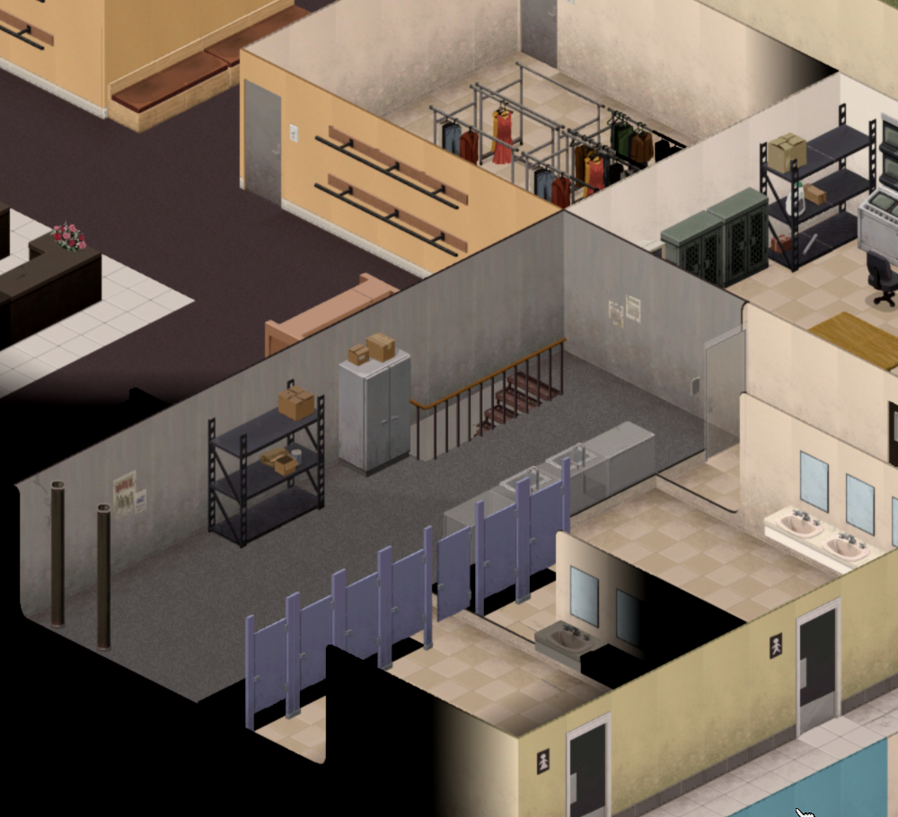 |
| Optional mods supported | * Ladders!? |
| ***Pros***: Easy access to nearby loot, tons of internal space | ***Cons***: Few places with more zombies than the mall |

| 11. P.S. Delilah | 2037, 5686 |
| ------------- | ---------- |
| 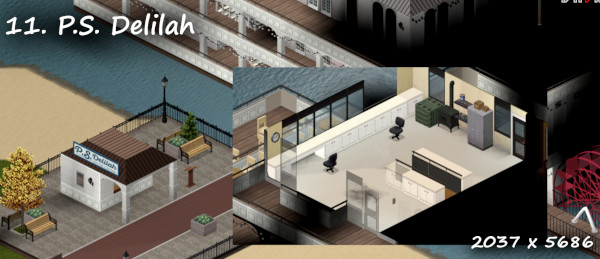 | 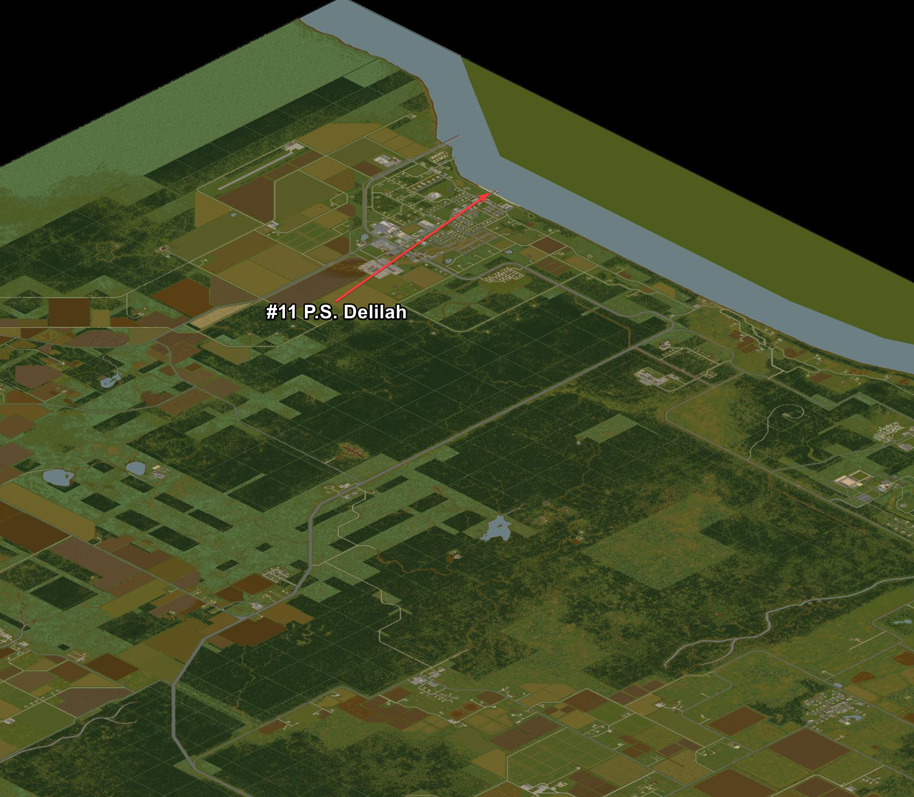 |
| Captain your own future from the bridge of the P.S.Delilah. While the engines are no longer functioning, this riverboat still features excellent storage spaces, massive power generators, and water tanks with pumps connected to the river. Keep the generator running and you'll never have water issues. Perhaps less comfortable for sleeping arrangements, the fully stocked kitchen and bar will at least distract you for awhile. | 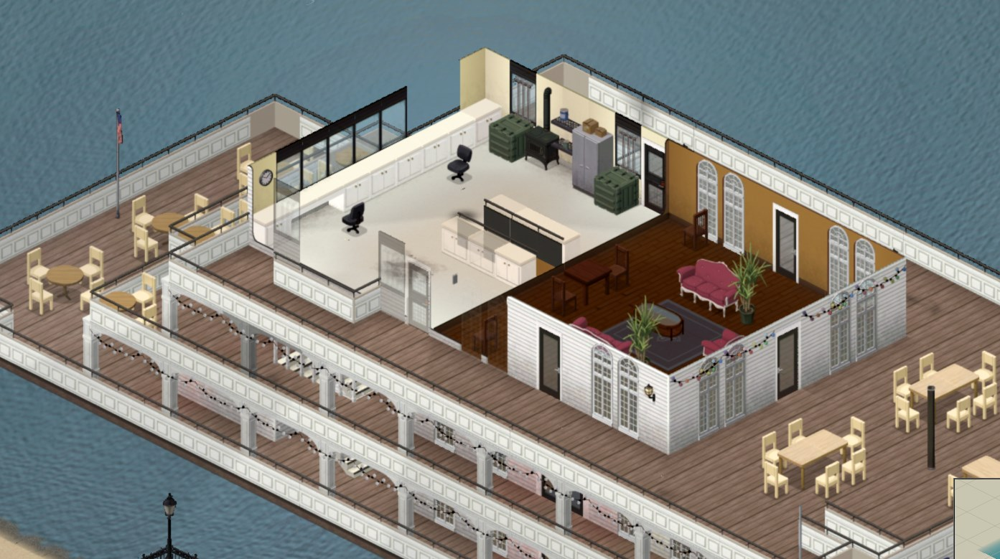 |
| Optional mods supported | * Functional Appliances 2 |
| ***Pros***: Easy to defend, lots of space to expand | ***Cons***: Poor sleeping arrangements and limited loot |

| 12. Ekron Community College Shelter | 764, 9821 |
| ------------- | ---------- |
| 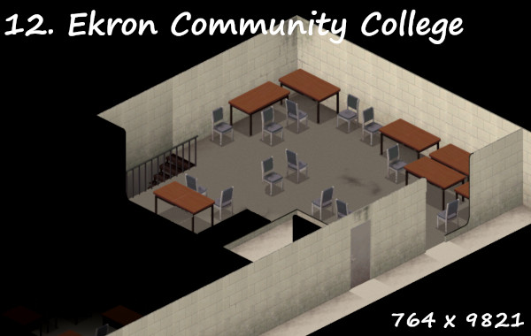 |  |
| _This is a copy of the March Ridge cold war bunker, but hidden within the college basement, making it 5 levels deep._ |  |
| Much like the public shelter hidden in the Grand Ohio Mall, buried in the basement of the ECC, four floors down you'll find a fully featured cold war era shelter. With full water and power and plenty of supplies, you'll be right at home. Comes with easy access to the college gym, if you need more of a workout than the stairs offer. | 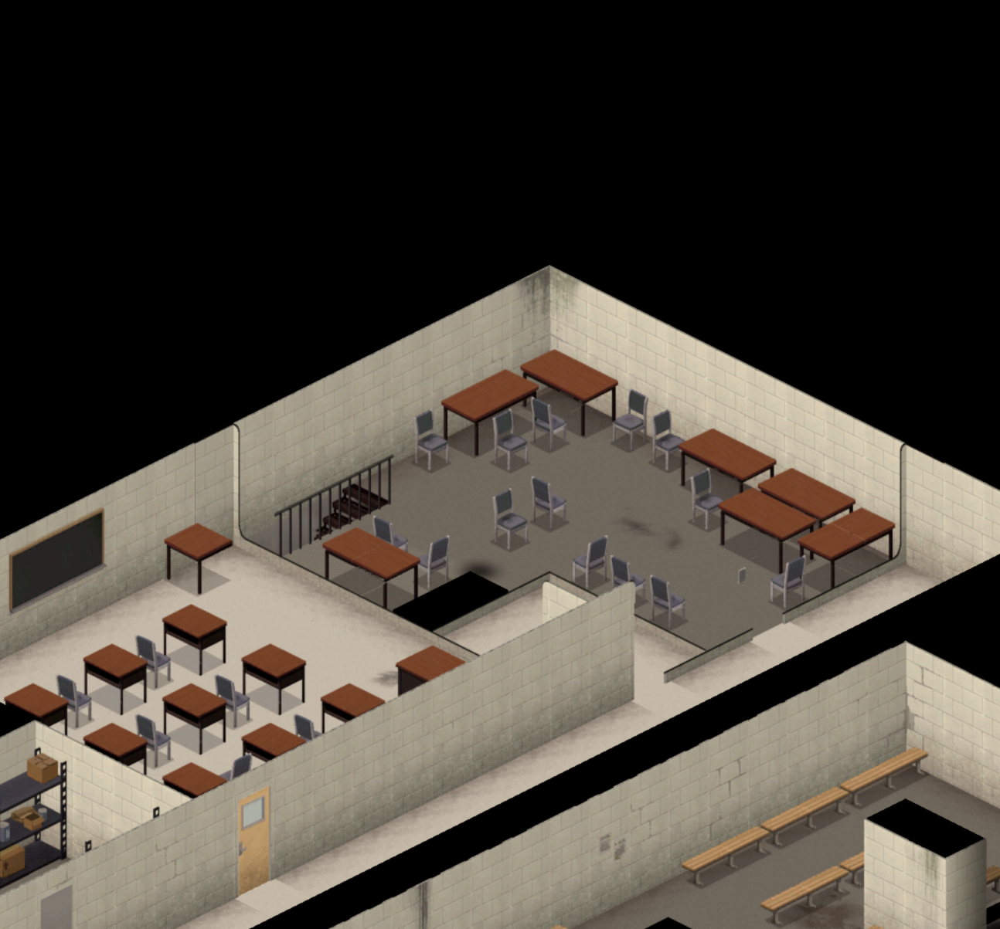 |
| Optional mods supported | * Ladders!? |
| ***Pros***: tons of space and loot | ***Cons***: tons of stairs, tons of zombies |

| 13. Louisville Pawn Shop | 12324, 1325 |
| ------------- | ---------- |
| 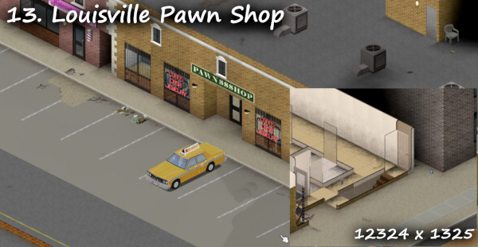 |  |
| With comfortable upstairs apartments, this pawnshop in west Louisville features a basement with generator, water storage and fallout shelter. While some of the tools and items within may be a little used, there's no shortage of items to choose from. | 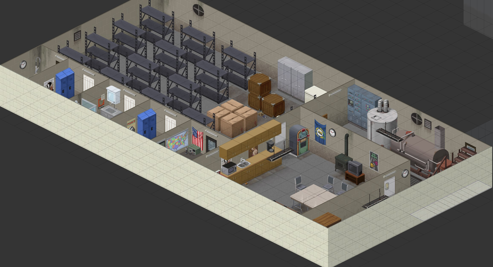 |
| Optional mods supported | * Ladders!? |
| ***Pros***: Unique space, plenty of loot | ***Cons***: No farming or fishing nearby, lots of zombies |

| 14. Louisville Auto Shop | 13139, 3025 |
| ------------- | ---------- |
| 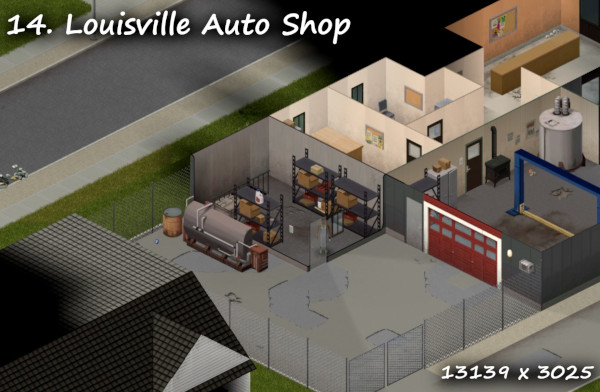 |  |
| While more recently closed and up for sale, this auto shop is very centrally located in Louisville. What it lacks in creature comforts it makes up for in location. Featuring a fallout shelter in the back storage room, wood stove, generator, and water tank, it's the perfect place to visit surrounding Louisville. Be sure to check out the farming store just a couple shops down, and if you need a drink, we've left some buy one get one coupons for Ol' Scratch pool hall down the street. | 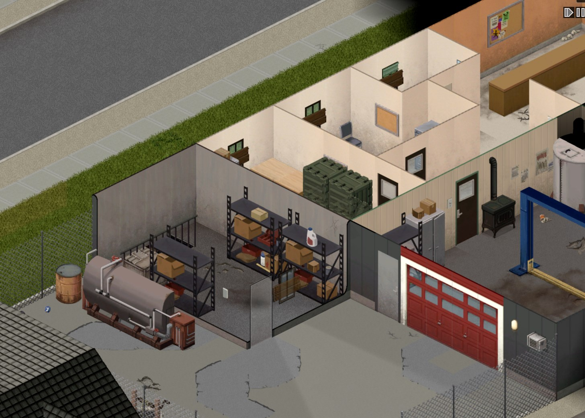 |
| Optional mods supported | * Ladders!? |
| ***Pros***: Central location, manageable zombie population, load of good nearby loot | ***Cons***: limited internal space, small basement |

| 15. Ekron Lake house | 1902, 9951 |
| ------------- | ---------- |
| 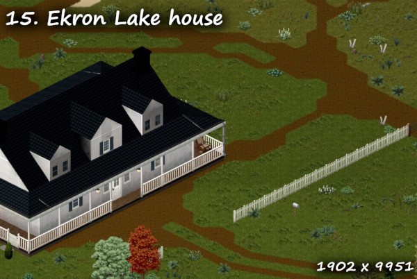 |  |
| If farming year round is appealing to you, don't miss this great farmhouse. With a private lake, greenhouse, chicken coop, shed and more, it's the perfect spot for those with a green thumb. Featuring a large basement with fallout shelter, plenty of storage, and a handy well, you may never have to visit nearby Ekron, but should you need to, you'll find it just a few minutes drive to the west. | 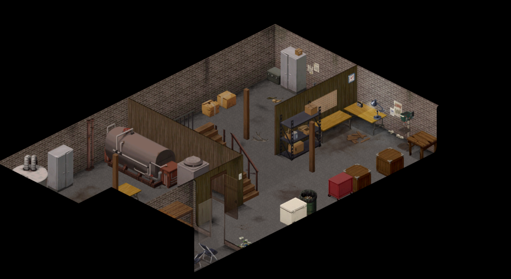 |
| Optional mods supported | * Ladders!? |
| ***Pros***: Expansive basement, strong farm potential, private lake | ***Cons***: bit far out from major areas |

| 16. East Louisville Farmhouse | 14584, 3036 |
| ------------- | ---------- |
| 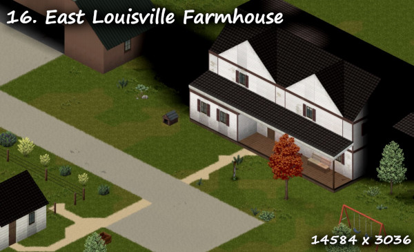 |  |
| Just a few minutes east of Louisville, near the airport, this pleasant home is fully off-grid. With an expansive basement, featuring a shooting range, generator, water, bunkrooms, private medical room, and workshop, your needs will be easily met here. Easy access to Louisville makes supply trips a breeze. The attached pasture comes with feeding troughs, and you'll really enjoy peaceful strolls through the forest just out the back of the home. | 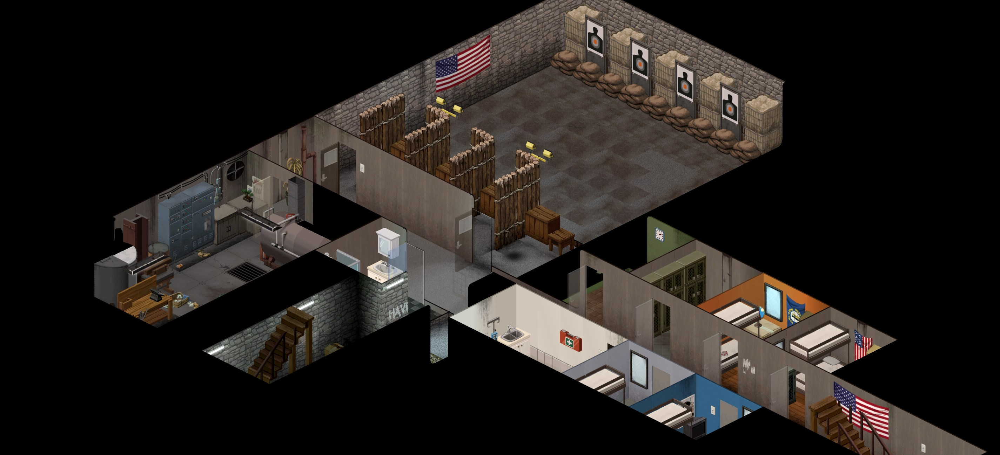 |
| Optional mods supported | * Ladders!? |
| ***Pros***: within the military parameter, but outside the city proper | ***Cons***: limited loot, bit of a drive to get anywhere |

| 17. The Caban Center Wildlife Rehab | 3108, 12053 |
| ------------- | ---------- |
| 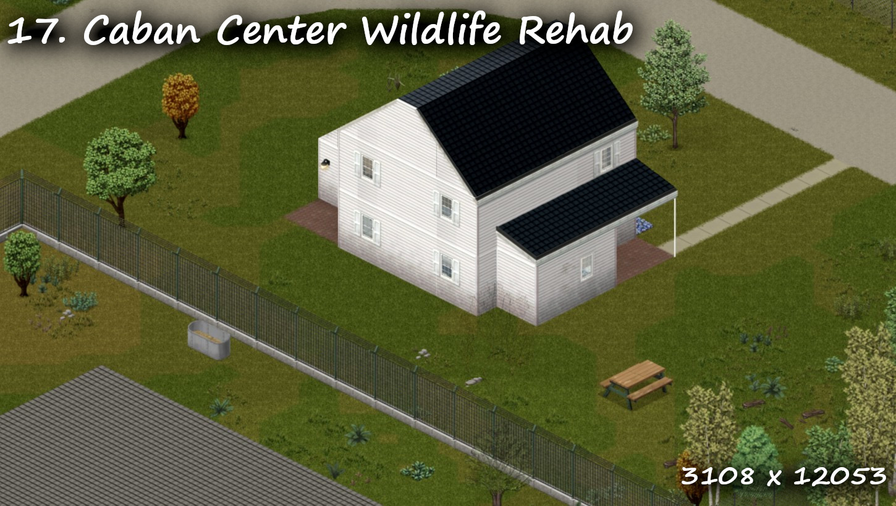 |  |
| With acres of animal enclosures, you won't spend much time in the small home here. When you are kicking back, enjoy the pool table down in the basement, where you'll also find your water, power, fallout shelter and work room. While less convenient, the basement's exterior entrance maximizes space on the first floor. The wildlife center is just a short drive from nearby Echo Creek. | 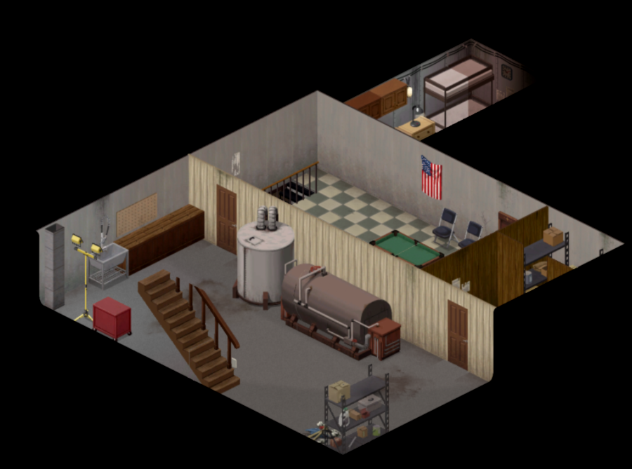 |
| Optional mods supported | * Ladders!? |
| ***Pros***: Animals, nice fully outfitted workroom, limited zombie population | ***Cons***: ages away from everything |

| 18. McCoy Estate | 10081, 8259 |
| ------------- | ---------- |
| 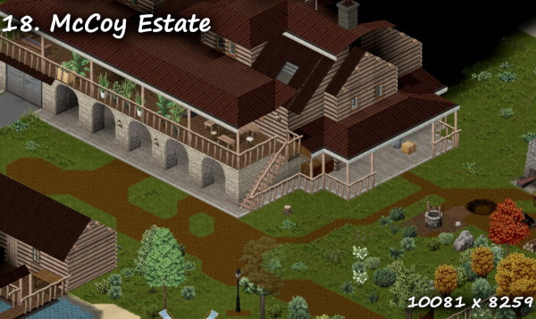 | 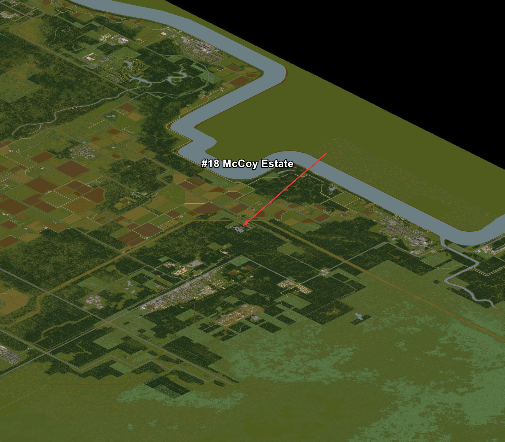 |
| They say you can't hide money, and the McCoy estate definitely shows it. While lacking a fallout shelter, this estate is far enough away from nearby towns to be relatively safe. With extensive well stocked freezers, tools, forges and furnaces, you may find yourself getting lost going from room to room. The generator under the shop powers a pumping system that supplies the full property with clean water from the nearby well and spring. While road access can be difficult in winter or muddy seasons, the chicken coop and well stocked gardens may keep you from ever needing to leave. | 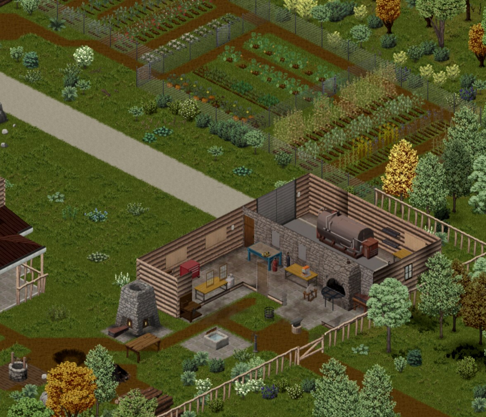 |
| ***Pros***: Tons of crafting equipment huge amounts of storage/loot | ***Cons***: you'll have to build a road to go anywhere, no basement beyond water/power utilities |

| 19. Central Louisville Mansion | 13441, 1895 |
| ------------- | ---------- |
| 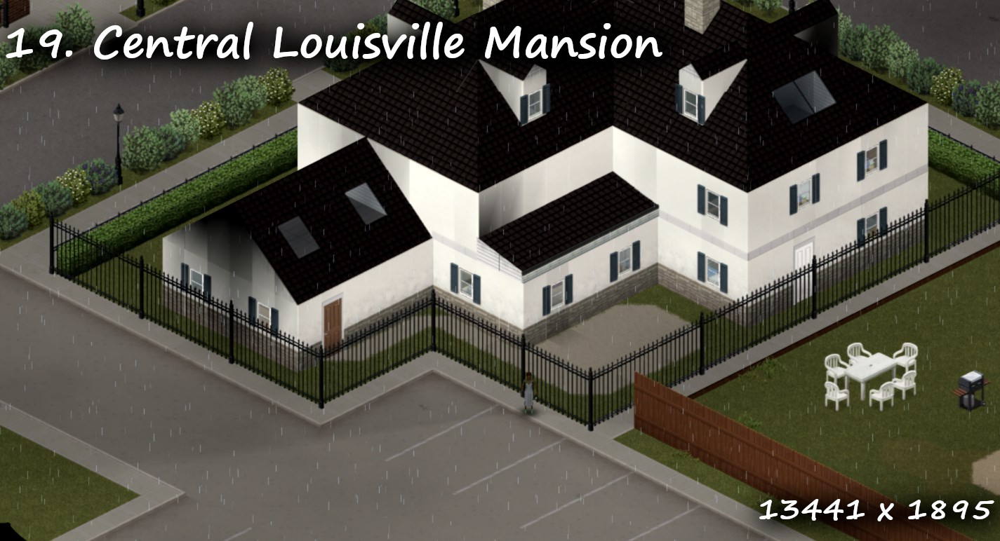 |  |
| If you've ever dreamt of having a grand piano this is the spot for you. Tucked away two floors below, this multi-million dollar home features a fallout shelter even the wealthiest will appreciate. Bring all your friends and family with two family suites and two expansive bunkrooms there's room for everyone. Enjoy the massive kitchen, full gym, laundry, showers, library and study, medical facilities, work room and storage "cavern." Expect things to be hairy once you return to the surface? Practice your shooting at the range so you'll be ready for anything. | 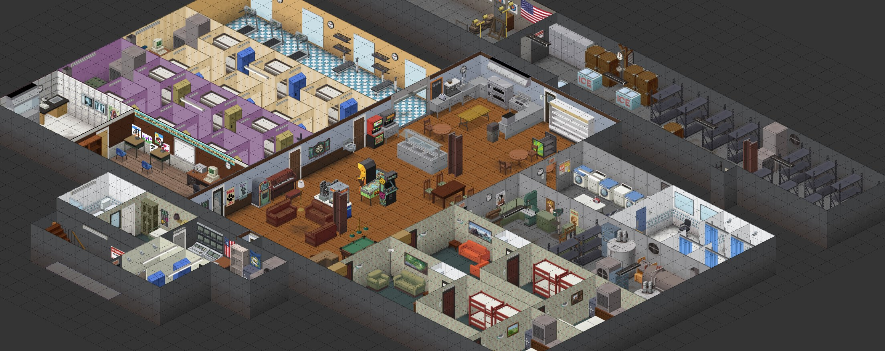 |
| Optional mods supported | * Ladders!? * Functional Appliances 2 |
| ***Pros***: Centrally located, large home space. | ***Cons***: lots of zombies, limited farming area |

| 20. Rural Scrapyard | 2937, 12523 |
| ------------- | ---------- |
| 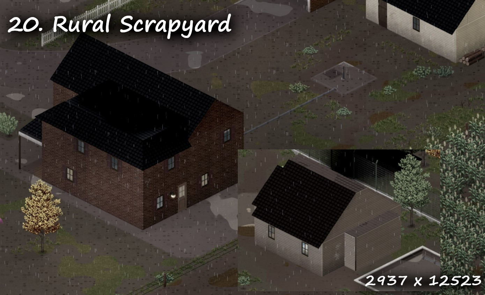 |  |
| This modest two story home hides a well kept secret tunnel to the scrapyard next door. Connecting two basements, the tunnel carries water from the spring to both homes, as well as power from the generator found in the scrapyard. Well stocked, both basements offer heaps of supplies for the long term, and nearby fields promise years of harvests to come. The nearby workshop and garage are also powered by the generator. | 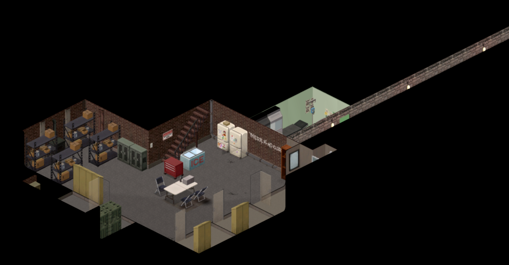 |
| Optional mods supported | * Ladders!? |
| ***Pros***: sweet custom basement connecting two homes, large scrapyard for materials or skills | ***Cons***: miles away from everything but still strong zombie presence |

| 21. Ekron Factory | 565, 9374 |
| ------------- | ---------- |
| 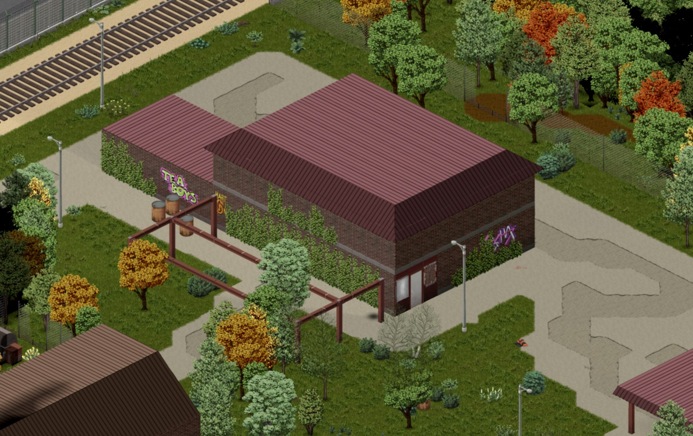 | 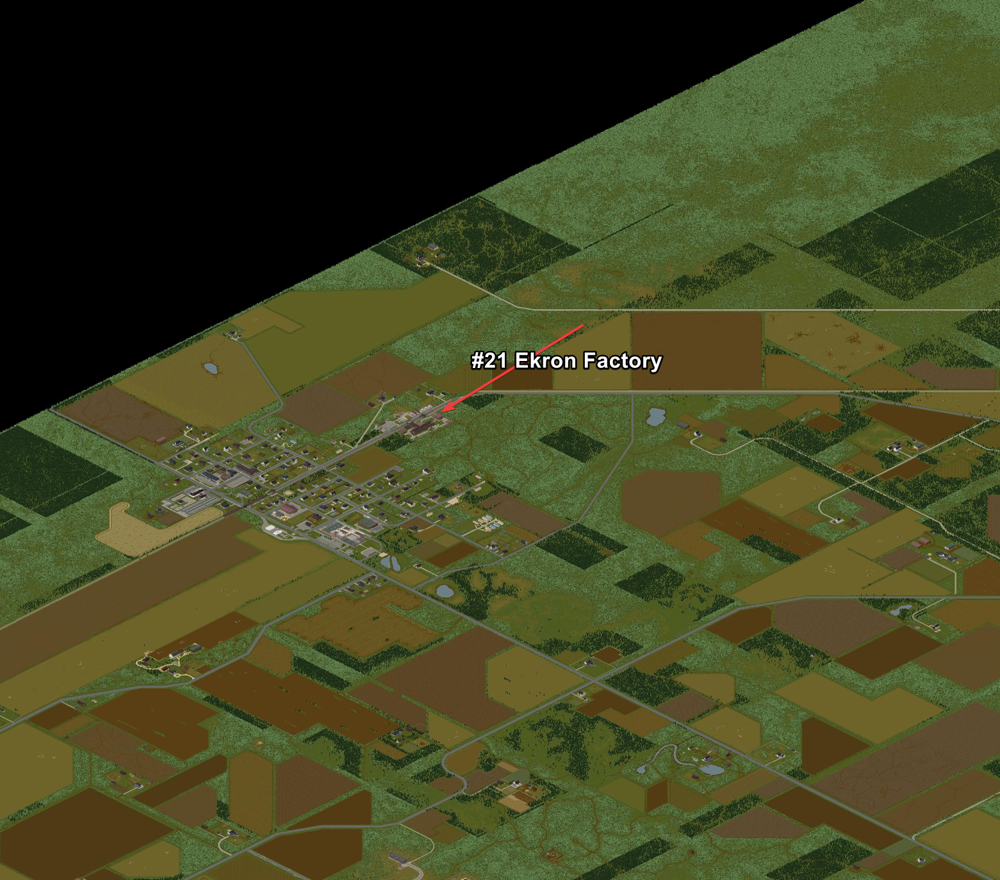 |
| Grittier than most places, this former factory bunkhouse may look rundown on the outside, but inside there are three floors of space. A small bomb shelter hides many essentials while the upper floors offer ample room to spread out. | 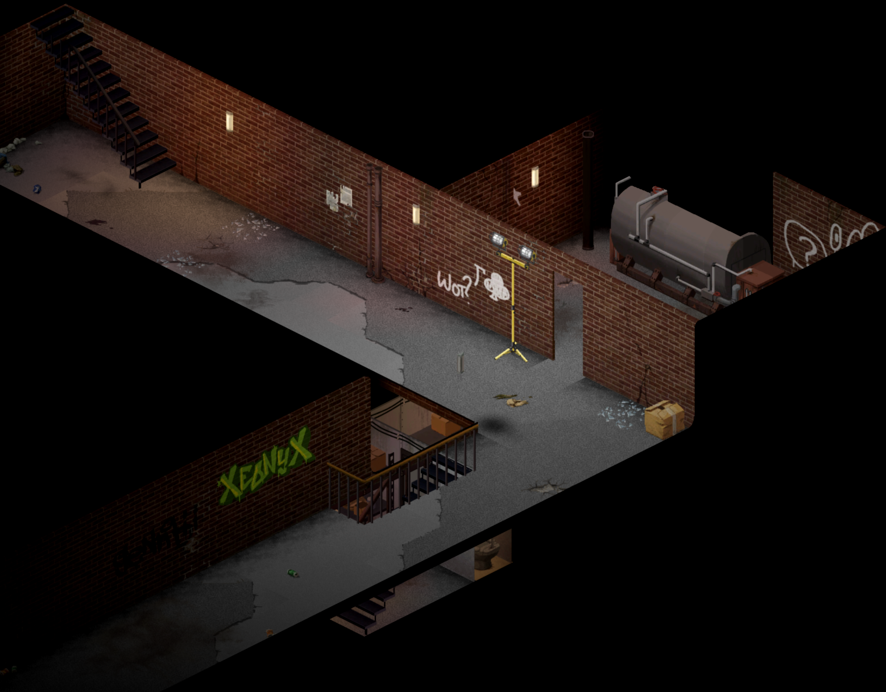 |
| Optional mods supported | * Ladders!? |
| ***Pros***: Edge of Ekron so easy access to the city, but low local zombie counts | ***Cons***: The comforts of home are a bit limited |

| 22. Cortman Medical | 10881, 10022 |
| ------------- | ---------- |
| 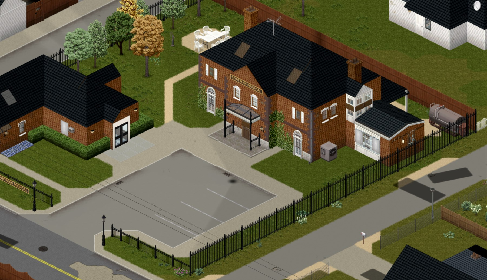 |  |
| What was this building being used for? What were they doing down in the basement? Either way it seems they were quite well stocked for something. | 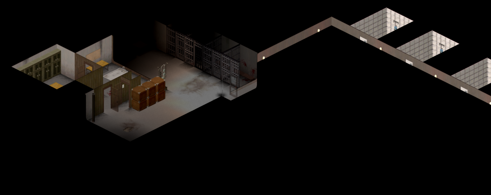 |
| Optional mods supported | * Ladders!? |
| ***Pros***: A custom basement connects the clinic with the doctor's home offering tons of space and loot | ***Cons***: Lots of zombies, basement is creepy |

| 23. Rusty Rifle | 10748, 10543 |
| ------------- | ---------- |
|  |  |
| It wasn't just underground gambling happening here, seems things go a little deeper than you might guess. Features large workroom, private medical facility and extra storage rooms. |  |
| Optional mods supported | * Ladders!? |
| ***Pros***: A custom basement connects the bar with the bar's storage building, plenty of storage/loot | ***Cons***: Lots of zombies |

| 24. March Ridge Secret Complex | 9850, 13111 |
| ------------- | ---------- |
|  |  |
| A normal military base house block above, but with each home connected to a secret complex underneath, one wonders what they were monitoring and why it had to be so well hidden. |  |
| Optional mods supported | * Gun's Elevator mod |
| ***Pros***: Fully custom, this compact basement is hidden 4 floors below, but features easy access to all the apartments above. | ***Cons***: Lots of zombies |

| 25. Riverside Mansion | 9850, 13111 |
| ------------- | ---------- |
|  |  |
| What do you do when you have lots of money, and lots of paranoia? Build a giant home underneath your own home as a fallout shelter for the end times of course. This normal looking suburban mansion features an expansive basement with all the amenities you could want for years to come. |  |
| Optional mods supported | * Functional Appliances 2 |
| ***Pros***: Massive fully custom basement with plenty of rooms and storage/loot | ***Cons***: Far away from many areas, still busy with zombies |

| 26. West Point Home | 11602, 6731 |
| ------------- | ---------- |
|  |  |
| This modest single family home comes with a fantastic rec room/man cave. Whether playing pool, pouring drinks or catching the latest blockbuster film, there's plenty for everyone here. In case you get stuck here for a long time, there's also a storage room with all the space you'll need, and an extra exit through the garage. |  |
| Optional mods supported | * Functional Appliances 2 |
| ***Pros***: Sweet custom basement, plenty of storage/loot, and entertainment options | ***Cons***: No fences, plenty of zombies nearby |

| 27. The Drake | 11908, 6853 |
| ------------- | ---------- |
|  |  |
| This West Point bar features 4 upstairs apartments, and is always busy. The downstairs storage areas are quite large and the previous owner made some solid cash renting out individual units. Best of all, hidden away at the back is a fallout shelter that will keep you going for years. |  |
| Optional mods supported | * Ladders!? |
| ***Pros***: Lots of empty space next to the shelter portion of the basement, 3 levels | ***Cons***: No good farming/fishing options, right in the center of town |

| 28. Ekron Pig Farm | 104, 8955 |
| ------------- | ---------- |
|  |  |
| If feeling secure and away from it all is important to you, you'll be in hog heaven with this estate north west of Ekron. Surrounded by strong fences, featuring a pig barn, chicken coop, shed, detached garage and sun room, the only thing missing is a nice herb garden. Duck global disaster in your own private fallout shelter with large attached, fully outfitted workroom |  |
| Optional mods supported | * Ladders!? |
| ***Pros***: Super isolated, bacon | ***Cons***: Super isolated |

| 29. Louisville Survival Complex | 14140, 2656 |
| ------------- | ---------- |
|  |  |
| Survive any disaster surrounded by your best mates. This set of three homes shares a single fenced entrance, and much more. Below each home you'll find a private fallout shelter, but if things aren't looking up, open up the connecting doors and enter a shared bunker that descends four floors underground with all the amenities you'll need to ride out any apocalypse. |  |
| Optional mods supported | * Functional Appliances 2 * Gun's Elevator mod |
| ***Pros***: Massive space with lots of supplies, close to Louisville locations | ***Cons***: Three generators to maintain, tunnels are quite long to move things around |

| 30. Irvington Townhouse | 2609, 14458 |
| ------------- | ---------- |
|  |  |
| This mid-range townhouse at the end of the row of units seems mediocre, but it turns out that it's hiding a full fallout shelter. Being nearly central to Irvington you'll find this location has plenty to offer. |  |
| Optional mods supported | * Ladders!? |
| ***Pros***: Lots of nearby townhouses also with basements | ***Cons***: Can be a lot of zombies in the area |

| 31. Prison Break | 7674, 12268 |
| ------------- | ---------- |
|  |  |
| A high profile prison break occurred using this tunnel. Authorities claim that it's been sealed off and poses no risk to the public. You'll find that many of the amenities and tools used to build the tunnel were left behind and the shelter space is well suited to waiting out any disaster.
*Do you relish a challenge? This map offers a spawn point inside the prison with a few contraband items. Good luck making it to the escape tunnel!* |  |
| Optional mods supported | * Ladders!? |
| ***Pros***: Fairly isolated, easy access to the prison basement, lots of materials for building the ultimate prison fortress | ***Cons***: This tunnel is super long for regular use, clearing the prison will take ages |

| 32. Quill Manor | 1221, 7384 |
| ------------- | ---------- |
|  |  |
| Once the home of an ultra-rich historical figure, this absolutely massive mansion caters to tourists, but if you want the full experience, slip past the guards and take the elevator down 10 floors underground to check out how the rich would live in the apocalypse. |  |
| Optional mods supported | * [Gun's Elevator mod](https://steamcommunity.com/sharedfiles/filedetails/?id=3411580812) *(Highly recommended)* |
| ***Pros***: Well outfitted, reasonably isolated from population centers | ***Cons***: 10 floors down no one can hear you scream, even if it's just because the power went out and you had to climb a ladder all ten floors |

| 33. Dark Wallow Cabin | 8718, 15311 |
| ------------- | ---------- |
|  |  |
| Nothing beats a lake front getaway. This three floor, medium sized home on the south side of Dark Wallow lake has great fishing access. As long as flooding isn't a concern for you, the basement fallout shelter can easily support your long term survival needs. |  |
| ***Pros***: More fishing than you can shake a stick at | ***Cons***: Pretty far away from everything |

| 34. Far East Muldraugh Hunting Cabin | 7674, 12268 |
| ------------- | ---------- |
|  |  |
| Get away from it all with this nicely isolated hunting cabin. The ultimate hunter's dream, this comfortable cabin features full power and water, and a large private lake with great fishing in case you need something when deer aren't in season. |  |
| ***Pros***: More fishing than you can shake a stick at | ***Cons***: Pretty far away from everything |

| 35. Muldraugh Drug Shack | 7674, 12268 |
| ------------- | ---------- |
|  |  |
| The drug trade is a rough life and it shows. This run down property features the leftovers of the drug trade, but shows great potential for the dedicated survivor looking to really put some ownership into how things look. Featuring a solid workroom and many leftovers, this fixer upper isn't far from Muldraugh proper, but far enough to feel like you're away from it all. |  |
| ***Pros***: Blank slate for fixing up however you like | ***Cons***: Very messy and lots of work to make comfortable |
