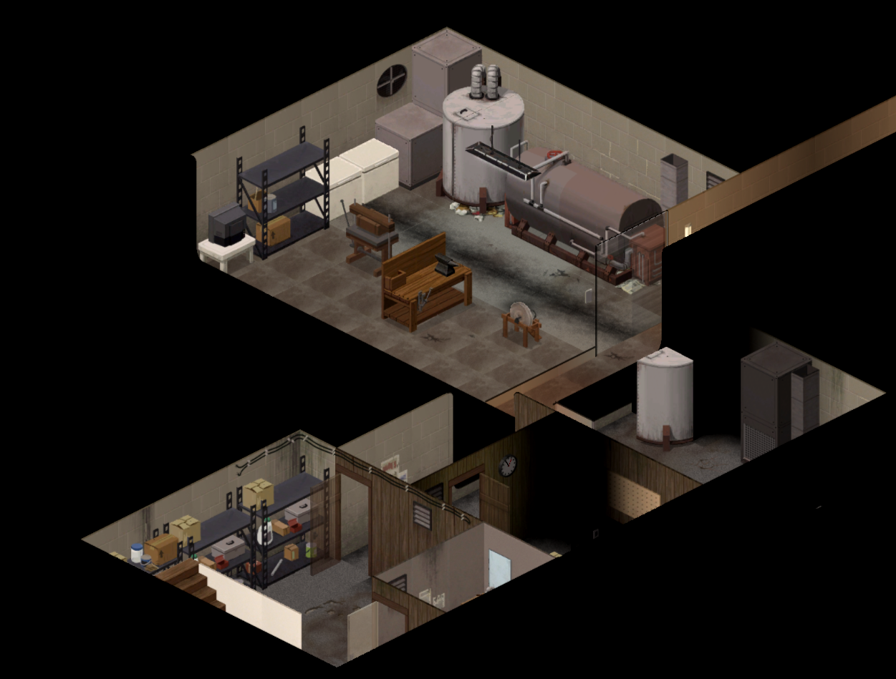
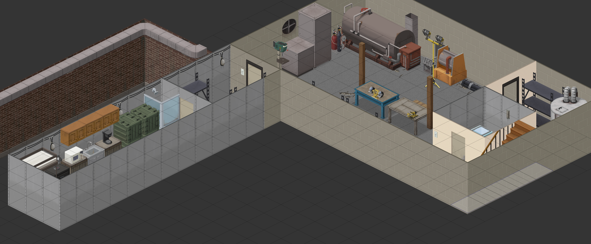
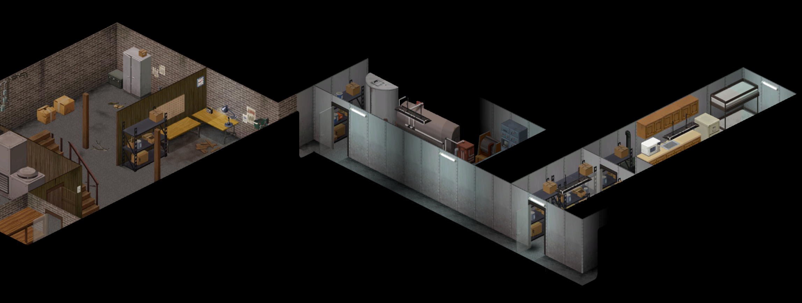
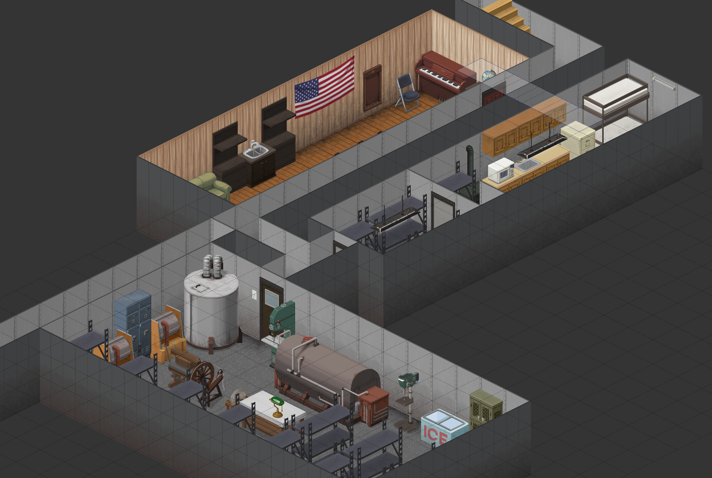

# Uncle Dave was a prepper!

Days ago a strange package from Uncle Dave arrived, it included a map and keys, but the note was cryptic and a bit confusing, but it's all starting to make sense now. It seems that Uncle Dave knew something was up and left some things for you.

Or grab the 10 years later mod and set out to find more food and fuel.

This mod provides a safehouse with water, power, and supplies. Use the options to set or exclude the various types, start with a map, or start in the safehouse.

Each safehouse is fully plumbed and powered. Keep your generator in good condition and enjoy your creature comforts like working washing machines and flushing toilets (until the tanks run dry at least). Every safehouse has a pump, if the generator is running, it will gradually refill the tank over time. Many safehouses have wells or spring water. Recent updates should allow you to move and replumb fixtures within a reaonsable radius of the original base so you can access the base's water tank.

Uncle Dave was quite a collector and you might find a complete seed library (mods that use seed in their item names should be included). He was well known for being quite a reader, so perhaps he'll have left his complete collection of skill books and magazines too (works with [Gyde's Trait Magazines](https://steamcommunity.com/sharedfiles/filedetails/?id=3342191739) and probably other mods that add anything to the skill category).

## About Loot
* Each location varies a bit, but will include a "essentials" storage with some commonly needed items.
* You can turn on all the locations and all the loot but this will probably make your game lag the first time you get near a base
* I had some trouble fitting in the skill books and if you have a bunch of mods you'll find your shelves very full 🤷‍♂️
* Recently I reworked some of the gun spawning. For most storages the lists work the same, pulling from the game's distribution lists, but I've added a "gun locker" for some spots. Instead of using the normal random distribution, it will build from a list ensuring some standard contents and a variable amount of ammo for the specific gun. At times the random spawn was giving me 10 guns and none of the clips for those guns at all. Lockers are also customized to have specific builds for the base game, but also if you use the [Vanilla Firearms Expansion](https://steamcommunity.com/sharedfiles/filedetails/?id=3434049989) or [Rain's Firearms & Gun Parts](https://steamcommunity.com/sharedfiles/filedetails/?id=3387222454) mods, you will find lockers built specifically for these mods. The guns are still random, but you'll get a full container of parts and ammo for a single gun with this change.

# Warning, spoilers below 😃

## Locations
| 1. Doe Valley | 5576, 9365 |
| ------------- | ---------- |
|  |  |
| This small bunker features a large generator and water tank, a small external storage area and is stocked with plenty of supplies. Perfect for those who prefer isolation, it's a good distance from everything. |  |
| ***Pros***: Isolated, plenty of trees | ***Cons***: Far from roads and major looting areas, not a lot of room for loot |

| 2. Echo Creek Gas Station | 3573, 10896 |
| ------------- | ---------- |
|  |  |
| Located in the heart of Echo Creek, this service station features everything you could need. The upstairs apartments are quite comfortable and you'll find heaps of supplies stored throughout the building. The generator and water tank are in the basement and supply the whole building. Gas pumps are also wired to the generator |  |
| ***Pros***: Center of small town, gas pumps | ***Cons***: far away from larger cities |

| 3. West Louisville Mansion | 12021, 2588 |
| ------------- | ---------- |
|  |  |
| This comfortable home features a standalone three car garage. The home and garage are fully powered. Due to the proximity to the river, this home features a pumping system that allows for the water storage to be refilled from the river when the generator is powered. Enjoy some down time in the garage loft with a game of pool, or relax catching some fish. Not far from all the great things that Louisville proper has to offer. |  |
| ***Pros***: Fully custom basement map, tons of storage | ***Cons***: Tons of zombies |

| 4. March Ridge Bunker | 9960, 12624 |
| ------------- | ---------- |
|  |  |
| This former cold war bunker offers the ultimate in safety. With tons of well stocked storage, this fully powered facility also comes with water tanks to support your off grid needs. Enjoy doing your laundry four floors underground, or kick back and chat with folks around the world on the command center ham radio. The stairs are great exercise, but you may want to hire some help to keep the tanks filled if you plan to stay here long term. Everything is self contained to prevent fallout contamination. |  |
| ***Pros***: Deep basement, loads of loot | ***Cons***: Lots of stairs, lots of zombies |

| 5. Muldraugh Safehouse | 10660, 9567 |
| ------------- | ---------- |
|  |  |
| Situated at the end of a cul-de-sac, this home features an expansive two level basement with a fallout shelter on the lowest level. Generator and water tank are found in the basement, but supply utilties for the whole home. Features plenty of storage and a nice area for gardening or raising animals. |  |
| ***Pros***: fully custom basement, solid location | ***Cons***: Small, lots of zombies |

| 6. Riverside Farmhouse | 6953, 5565 |
| ------------- | ---------- |
|  |  |
| Located just east of Riverside, this farmhouse also features a two level basement, chicken coop, and fallout shelter. A little walk from the neighborhoods and shops, but far enough away for peace and quiet. Basement level generator and water tank supply the whole home. |  |
| ***Pros***: reasonably isolated, 2 level basement | ***Cons***: bit of a trek to get anywhere |

| 7. Rosewood Gas Station | 8179, 11269 |
| ------------- | ---------- |
|  |  |
| The large basement of this gas station sports a water tank and generator supplying the whole building. A comfortable upstairs aparment features all the latest amenities while the ample storage areas contain plenty of supplies. Gas pumps are also wired to the generator. |  |
| ***Pros***: Gas pumps, edge of town location | ***Cons***: limited space, heavy zombies nearby |

| 8. Rural West Point Mansion | 10162, 6622 |
| ------------- | ---------- |
|  |  |
| Located off the beaten path, this posh home is perfect for those seeking to get away from it all. A decent drive from West Point, this home backs up to the river. Not only is there good fishing on the river, if you make friends with the neighbor there's also a private fishing pond in the community. The two level basement includes generator, water tank, and fallout shelter. The whole home features plenty of storage and supplies. |  |
| Supports the Taylorsville map mod | [Taylorsville](https://steamcommunity.com/sharedfiles/filedetails/?id=3134394569) |
| ***Pros***: super isolated, large 2 level basement | ***Cons***: super isolated, quite a trek to town |

| 9. Lowry Court Apartments | 12993, 1914 |
| ------------- | ---------- |
|  |  |
| These average aparments in the center of Louisville feature massive enclosed garage areas, a private courtyard (perhaps you can organize a community garden), a fallout shelter, generator, and water storage. While the entire building is not serviced, backup power and water can be found in 3rd floor apartments on the south west side. |  |
| ***Pros***: fully fenced courtyard, centrally located | ***Cons***: Huge amount of zombies nearby, limited basement area |

| 10. Grand Ohio | 13649, 1272 |
| ------------- | ---------- |
|  |  |
| _This is a copy of the March Ridge cold war bunker, but with the enterance just behind the mall security office_ |  |
| During the cold war era many public shelters were built. Now that the cold war has ended, they are often forgotten, filled with dust and relics. Found just behind the security center for the mall, this bunker features well stocked storage, power, and water, 4 floors underneath the mall proper. As with other deep facilities this was designed to protect the supplies, not make them easy to restock so you may get tired of all the stairs. |  |
| ***Pros***: Easy access to nearby loot, tons of internal space | ***Cons***: Few places with more zombies than the mall |

| 11. P.S. Delilah | 2037, 5686 |
| ------------- | ---------- |
|  |  |
| Captain your own future from the bridge of the P.S.Delilah. While the engines are no longer functioning, this riverboat still features excellent storage spaces, massive power generators, and water tanks with pumps connected to the river. Keep the generator running and you'll never have water issues. Perhaps less comfortable for sleeping arrangements, the fully stocked kitchen and bar will at least distract you for awhile. |  |
| ***Pros***: Easy to defend, lots of space to expand | ***Cons***: Poor sleeping arrangements and limited loot |

| 12. Ekron Community College Shelter | 764, 9821 |
| ------------- | ---------- |
|  |  |
| _This is a copy of the March Ridge cold war bunker, but hidden within the college basement, making it 5 levels deep._ |  |
| Much like the public shelter hidden in the Grand Ohio Mall, buried in the basement of the ECC, four floors down you'll find a fully featured cold war era shelter. With full water and power and plenty of supplies, you'll be right at home. Comes with easy access to the college gym, if you need more of a workout than the stairs offer. |  |
| ***Pros***: tons of space and loot | ***Cons***: tons of stairs, tons of zombies |

| 13. Louisville Pawn Shop | 12324, 1325 |
| ------------- | ---------- |
|  |  |
| With comfortable upstairs apartments, this pawnshop in west Louisville features a handy rooftop generator, a two level basement with water storage and fallout shelter. While some of the tools and items within may be a little used, there's no shortage of items to choose from. |  |
| ***Pros***: Unique space, 2 level basement, plenty of loot | ***Cons***: No farming or fishing nearby, lots of zombies |

| 14. Louisville Auto Shop | 13139, 3025 |
| ------------- | ---------- |
|  |  |
| While more recently closed and up for sale, this auto shop is very centerally located in Louisville. What it lacks in creature comforts it makes up for in location. Featuring a fallout shelter in the back storage room, wood stove, generator, and water tank, it's the perfect place to visit surrounding Louisville. Be sure to check out the farming store just a couple shops down, and if you need a drink, we've left some buy one get one coupons for Ol' Scratch pool hall down the street. |  |
| ***Pros***: Central location, manageable zombie population, load of good nearby loot | ***Cons***: limited internal space, small basement |

| 15. Ekron Lake house | 1902, 9951 |
| ------------- | ---------- |
|  |  |
| If farming year round is appealing to you, don't miss this great farmhouse. With a private lake, greenhouse, chicken coop, shed and more, it's the perfect spot for those with a green thumb. Featuring a large two level basement with fallout shelter, plenty of storage, and a handy well, you may never have to visit nearby Ekron, but should you need to, you'll find it just a few minutes drive to the west. |  |
| ***Pros***: 2 level basement, strong farm potential, private lake | ***Cons***: bit far out from major areas |

| 16. East Louisville Farmhouse | 14584, 3036 |
| ------------- | ---------- |
|  |  |
| Just a few minutes east of Louisville, near the airport, this pleasent home is fully off-grid. With an expansive two level basement, fallout shelter, generator and water, your needs will be easily met here. While not offering long term water solutions, the easy access to Louisville makes supply trips a breeze. The attached pasture comes with feeding troughs, and the generator is out in the shed for a nice noise reduction in the main house. |  |
| ***Pros***: within the military parameter, but outside the city proper | ***Cons***: limited loot, bit of a drive to get anywhere |

| 17. The Caban Center Wildlife Rehab | 3108, 12053 |
| ------------- | ---------- |
|  |  |
| With acres of animal enclosures, you won't spend much time in the small home here. When you are kicking back, enjoy the pool table down in the two level basement, where you'll also find your water, power, and a small fallout shelter. While less convient, the basement's exterior entrance maximizes space on the first floor. The wildlife center is just a short drive from nearby Echo Creek. |  |
| ***Pros***: Animals, 2 levels of basement and room to expand, limited zombie population | ***Cons***: ages away from everything |

| 18. McCoy Estate | 10081, 8259 |
| ------------- | ---------- |
|  |  |
| They say you can't hide money, and the McCoy estate definitly shows it. While lacking a fallout shelter, this estate is far enough away from nearby towns to be relatively safe. With extensive well stocked freezers, tools, forges and furnaces, you may find yourself getting lost going from room to room. The generator found in the shop powers a pumping system that supplies the full property with clean water from the nearby well and spring. While road access can be difficult in winter or muddy seasons, the chicken coop and well stocked gardens may keep you from ever needing to leave. |  |
| ***Pros***: Tons of crafting equipment huge amounts of storage/loot | ***Cons***: you'll have to build a road to go anywhere, no basement |

| 19. Central Louisville Mansion | 13441, 1895 |
| ------------- | ---------- |
|  |  |
| If you've ever dreamt of having a grand piano this is the spot for you. This three floor mansion features a secret basement found in the storage room and offers two more levels including a fallout shelter. Also hidden in the basement are long term water and power which supply the whole home with all it needs. |  |
| ***Pros***: Centrally located, large home space. | ***Cons***: lots of zombies, limited farming area |

| 20. Rural Scrapyard | 2937, 12523 |
| ------------- | ---------- |
|  |  |
| This modest two story home hides a well kept secret tunnel to the scrapyard next door. Connecting two basements, the tunnel carries water from the spring to both homes, as well as power from the generator found in the scrapyard. Well stocked, both basements offer heaps of supplies for the long term, and nearby fields promise years of harvests to come. The nearby workshop and garage are also powered by the generator. |  |
| ***Pros***: sweet custom basement connecting two homes, large scrapyard for materials or skills | ***Cons***: miles away from everything but still strong zombie presence |

| 21. Ekron Factory | 565, 9374 |
| ------------- | ---------- |
|  |  |
| Grittier than most places, this former factory bunkhouse may look rundown on the outside, but inside there are four floors of space. A small bomb shelter hides many essentials while the upper floors offer ample room to spread out. |  |
| ***Pros***: Edge of Ekron so easy access to the city, but low local zombie counts | ***Cons***: The comforts of home are a bit limited |

| 22. Cortman Medical | 10881, 10022 |
| ------------- | ---------- |
|  |  |
| What was this building being used for? What were they doing down in the basement? Either way it seems they were quite well stocked for something. |  |
| ***Pros***: A custom basement connects the clinic with the doctor's home offering tons of space and loot | ***Cons***: Lots of zombies, basement is creepy |

| 23. Rusty Rifle | 10748, 10543 |
| ------------- | ---------- |
|  |  |
| It wasn't just underground gambling happening here, seems things go a little deeper than you might guess. |  |
| ***Pros***: A custom basement connects the bar with the bar's storage building, plenty of storage/loot | ***Cons***: Lots of zombies |

| 24. March Ridge Secret Complex | 9850, 13111 |
| ------------- | ---------- |
|  |  |
| A normal military base house block above, but with each home connected to a secret complex underneath, one wonders what they were monitoring and why it had to be so well hidden. |  |
| ***Pros***: Fully custom, this compact basement is hidden 4 floors below, but features easy access to all the apartments above. | ***Cons***: Lots of zombies |
*Bonus, elevator works with [Gun's Elevator mod](https://steamcommunity.com/sharedfiles/filedetails/?id=3411580812)*

| 25. Riverside Mansion | 9850, 13111 |
| ------------- | ---------- |
|  |  |
| What do you do when you have lots of money, and lots of paranoia? Build a giant home underneath your own home as a fallout shelter for the end times of course. This normal looking suburban mansion features an expansive basement with all the amenities you could want for years to come. |  |
| ***Pros***: Massive fully custom basement with plenty of rooms and storage/loot | ***Cons***: Far away from many areas, still busy with zombies |
